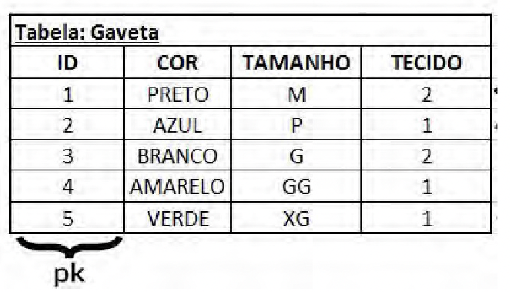

# Aulas

> "Não se preocupe se não funcionar direito. Se tudo funcionasse, você estaria desempregado". — Lei de Mosher da Engenharia de Software

### MÉTODOS HTTP

- Existem 8 métodos HTTP e eles fazem a comunicação entre os nós da rede.

- GET (Obter) (Chega o Corpo/Body da requisição)

- Se alguém disser "Mim dá um copo d'água pra mim" vai ser estranho. Certo? A frase está errada. Sonoramente falando é estranho.

- O mesmo acontece quando é feito um POST em uma API para buscar um recurso. Não soa bem, é estranho.

- Em ambos casos o receptor pode entender a mensagem, mas não estão de acordo com o padrão da linguagem.

- Em linhas gerais e ignorando alguns conceitos. O HTTP assim como o português é um protocolo de comunicação.

- POST (**Inserção**) / PUT (**Alterações Totais**) / PATCH (**Alterações Parciais**) / DELETE (Deleta registros) 

1. POST

    - No POST você insere novos dados no servidor.

2. PUT

    - Caso você queira fazer **alterações totais** no servidor (Exemplo: Caso queira alterar todos os atributos de um cliente, pessoa, produto, etc...) O PUT é mais comumente usado.

3. PATCH

    - Caso você queira fazer **alterações parciais** no servidor. (Exemplo: Mudar um ou outro atributo de um cliente, pessoa, produto, etc...)

4. OPTIONS

    - Se você tem uma url `"/ola"` por exemplo, que suporta requisições do tipo GET e POST, se você fizer requisições do tipo OPTIONS em cima da url `"/ola"`, ela vai retornar os métodos HTTP que essa url suporta.

5. TRACE

    - O método HTTP TRACE realiza um teste de loopback enviando uma mensagem por todo o caminho até o recurso alvo no qual foi destinado, provendo um mecanismo útil para debug.

6. HEAD

    - O método HTTP HEAD solicita os cabeçalhos retornados de um recurso específico que foi requisitado por um método HTTP GET . Tal solicitação pode ser feita antes de baixar um grande recurso para economizar largura de banda, por exemplo. Uma resposta para um método HEAD não deve ter um corpo. Se tiver, deve ser ignorado.

- A título de curiosidade e comparação com o padrão Restfull, o **GRAPHQL** vem como alternativa a uma API do tipo Restfull, e o GraphQL usa para inserir, o método POST. Pra alterar, o método POST, pra deletar, o método POST também. E para ler um registro, ele usa o método GET. Ou seja o GraphQL usa apenas o método GET e o método POST.

----

## BANCO DE DADOS RELACIONAL (SQL)

- Nos primórdios os dados eram armazenados na própria aplicação, e isso pode ser um problema gigantesco, exemplo de um dos problemas dessa "arquitetura": para indexar e reindexar dados podia gerar perda de algum dado. 

- O SQL foi desenvolvido originalmente no início dos anos 70 nos laboratórios da IBM em San Jose, dentro do projeto System R, que tinha por objetivo demonstrar a viabilidade da implementação do modelo relacional proposto por E. F. Codd.

- Embora o SQL tenha sido originalmente criado pela IBM, rapidamente surgiram vários "dialetos" desenvolvidos por outros produtores.

- SGBD (Sistemas Gerenciador de Banco de Dados): Oracle, PostgreSQL

- SQL (Linguagem de Consulta Estruturada)

- Independentemente do aplicativo que se deseja usar para o armazenamento
e manipulação das informações, todos os bancos de dados são constituídos
por elementos básicos: **campos, colunas, linhas ou tuplas e tabelas**.

- **Campos** são os espaços reservados para inserção de um determinado dado;
as **colunas** são os registros de um determinado campo; as tuplas são as linhas
de registros de um conjunto de campos; e as **tabelas** são os conjuntos de linhas,
campos e colunas.

- Cada banco é um conjunto de tabelas relacionadas. Também são chamados
de relações, daí o nome banco de dados relacional. Cada tabela é uma
representação física de uma entidade ou objeto que está em um formato tabular

1. MODELO ENTIDADE/RELACIONAMENTO

    - A **entidade** seria a nossa tabela, os dados são armazenados de forma tabular. Ex: Carro e seus atributos

    - O **relacionamento** está relacionado à relação que tal tabela tem com outra. Ex: Produtos está relacionado a um cliente.

2. CHAVE PRIMÁRIA

    - Única, não muda, não vazia.

    - Você deve ter uma chave primária, pois será um registro que
  não sofrerá alteração e nem se repetirá. Sempre será único e
  imutável. Só assim você terá a consistência de seus dados. Para
  alterar um registro na tabela, você deve buscá-lo por sua PK, assim
  não ocorrerá de alterar um registro incorreto.

3. SQL

    - **DML Linguagem de Manipulação de Dados**: 
    
        - Esses comandos indicam
      uma ação para o SGBD executar. Utilizados para recuperar, inserir
      e modificar um registro no banco de dados. Seus comandos são:
      INSERT, DELETE, UPDATE, SELECT e LOCK;

    - **DDL Linguagem de Definição de Dados:**:

        - Comandos DDL são responsáveis
      pela criação, alteração e exclusão dos objetos no banco de dados.
      São eles: CREATE TABLE, CREATE INDEX, ALTER TABLE, DROP
      TABLE, DROP VIEW e DROP INDEX;

    - **DCL Linguagem de Controle de Dados:**

        - Responsável pelo controle de
      acesso dos usuários, controlando as sessões e transações do SGBD. Alguns
      de seus comandos são: COMMIT, ROLLBACK, GRANT e REVOKE.

4. PL/PGSQL

  - Se você trabalha ou já trabalhou com o Oracle, sabe o que é o
PL/SQL. É a linguagem procedural do banco de dados Oracle que
permite a inclusão de lógica no SGBD. Já o PL/pgSQL (Procedural
Language/PostgreSQL) é a linguagem de programação procedural do
PostgreSQL. Com ela, é possível inserir lógica em seu banco de
dados.

  - Neste momento, você deve estar se perguntando por que
precisaríamos de lógica ou de uma linguagem para trabalhar com
banco de dados, já que os comandos SQL conseguem apenas
manipular os dados seu em SGBD. Explicarei o porque mais a frente.

  - PL/pgSQL é uma linguagem procedural que você grava no
sistema de banco de dados PostgreSQL. Os objetivos do PL/pgSQL
foram criar uma linguagem procedural carregável que pode ser
usada para criar funções e procedimentos de gatilhos, acrescentar
estruturas de controle à linguagem SQL, poder realizar cálculos
complexos, e herdar todos os tipos, funções e operadores definidos
pelo usuário. Ela pode ser definida para ser confiável para o servidor
e ser fácil de usar.

- Funções criadas com PL/pgSQL podem ser usadas em qualquer
lugar em que funções internas são utilizadas. Por exemplo, é
possível criar funções de cálculo condicional complexos e depois
usá-las em chamadas de triggers.

5. DATATYPES

  - Cada informação deve ser armazenada com o seu tipo correto.
Isto é, um campo em que serão inseridos apenas números deverá ser
do tipo numérico. É extremamente importante e crítico fazer a
escolha do tipo de cada informação que você vai armazenar.

  - Campos do tipo **STRING**

    - `varying(n)` variável do tipo string, limite entre parênteses.

    - `varchar(n)` tipo de variável padrão para o tipo string, limite entre parênteses.

    - `character(n)` tipo de variável string

    - `char(n)` tipo de string que possui tamanho fixo, entre parênteses deve ser informado o número de caracteres.

    - `text` variável de tamanho ilimitado (Ex: textos, descrição, observação)

  - Campos do tipo **Boolean**

    - São utilizadas para ver se tal expressão é verdadeira ou falsa. Veremos na prática adiante.

  - Campos do **Tipo Numérico**

    - `smallint` capacidade de 2 bytes de armazenamento e pequena variação. Suporta números inteiros de -32768 até +32767.

    - `integer` capacidade de 4 bytes de armazenamento, principal escolha para utilizar em campos numéricos inteiros.

    - `bigint` capacidade de 8 bytes de armazenamento.

    - `decimal` tipo numérico usado especificamente quando precisar armazenar números com precisão decimal.

    - `numeric` também usado quando precisar armazenar números com precisão decimal.

    - `real` capacidade de 4 bytes de armazenamento. Esse tipo de campo armazena números reais e com até 6 dígitos decimais.

    - `double` capacidade de 8 bytes de armazenamento. Pode armazenar até 15 dígitos nas casas decimais.

    - `smallserial` capacidade de 2 bytes de armazenamento. Este campo é um que se autoincrementa. Armazena inteiros de 1 até 32767

    - `serial` capacidade de 4 bytes de armazenamento, também é um campo de autoincremento, é maior que o anterior.

    - `bigserial` capacidade de 8 bytes de armazenamento.

  - **Campo Autoincremental**

  

  - Eu não precisei inserir registro no campo `controle` pois ele é autoincremental. O id segue esse princípio, se autoincrementa a cada novo registro.

  - São campos que possuem a capacidade de aumentar automaticamente. A cada novo registro na tabela, ele soma +1 ao número anterior e insere no campo

  - Campos do **Tipo Data**

  

    - Campos do **Tipo Data**

      - `timestamp` capacidade de armazenamento de 8 bytes. Armazena data e hora.

      - `date` capacidade de armazenamento de 4 bytes. Armazena apenas data.

      - `time` capacidade de armazenamento de 8 bytes. Armazena apenas hora.

  - Campos do **Tipo Full Text Search**

  

    - Nesse contexto, os tipos usados para Full Text Search (FTS) são eles:

      - `tsvector` tipos de dados que representa um documento, como uma lista ordenada e com posições no texto.

      - `tsquery` tipo de dado para busca textual que suporta operadores booleanos.

  - **Tipo XML**

    - XML, ame ou odeie. Há uma grande quantidade de dados em
  formatos XML, e esse fato não está mudando rapidamente devido a
  um grande investimento em XML. Ocasionalmente, inserir dados
  XML em um banco de dados relacional pode render uma vitória
  quando a integração com fontes de dados externas fornece dados
  em XML.

    - PostgreSQL tem a capacidade de manipular dados XML com
  SQL, permitindo um caminho para integrar dados XML em
  consultas SQL. A declaração deste tipo de campo é como a dos
  outros tipos.

  - **Tipo JSON**

    - PostgreSQL tem suporte a JSON já algum tempo, foi adicionado a funcionalidade para armazenar
  JSON como JSON Binário (JSONB), que remove os espaços em
  branco insignificantes (não que seja um grande negócio), acrescenta
  um pouco de sobrecarga quando inserir dados, mas fornece um
  benefício enorme ao consultar.

  - **Tipo Array**

  

    - `integer[n]` array do tipo inteiro.

    - `varchar[n][n]` array do tipo varchar bidimensional n por n.

    - `double array` array do tipo double unidimensional de tamanho indefinido.

  - **Tipo Composto**

  

  - **Tipos Personalizados**

    - É possível criar tipos de dados personalizados pelo comando `create type`, no qual podemos criar um novo tipo de
  campo. Ele pode ser composto por vários campos, ou pode ser uma lista de valores.

6. DER

7. CHAVE ESTRANGEIRA

  - As chaves estrangeiras, ou foreign-keys, são identificadores
únicos que fazem referência à chave primária de outra tabela. Se
tivermos uma FK em nossa tabela, não conseguimos inserir um
registro que não esteja contido na tabela referenciada.

  - O exemplo a seguir mostra duas tabelas: uma de funcionários e
uma de cargos. O ID da tabela CARGOS , que é uma chave primária, passa a ser uma chave estrangeira na tabela
FUNCIONARIOS , chamada CARGO_ID . Ela, por sua vez, não vai
permitir a inserção de nenhum cargo que não esteja cadastrado na
tabela CARGOS , dando para sua tabela consistência e evitando erros.

8. CRIANDO TABELAS

  - Abra o terminal de comandos instalado na instalação do
PostgresSQL para criarmos os objetos em nosso banco.
O `create table` é o comando usado para criar tabelas.
Sabendo disso, vamos à criação delas.

