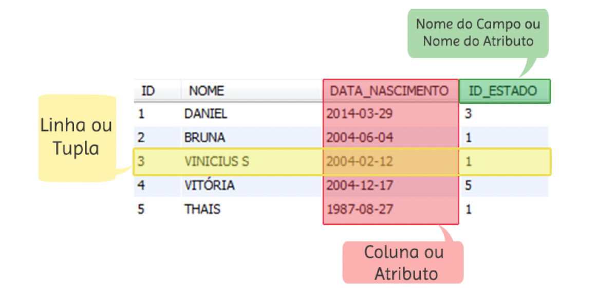

# ECOSSISTEMA JAVA



> Quando a gente cria um programa em Java, ele roda em cima da **JRE**. Dentro da JRE, tem a **JVM** que interpreta nosso programa.

> Quando vc cria um programa em Java e compila ele, ao contrário da linguagem C por exemplo, ele não gera um executável para o sistema operacional, ele não roda em cima do windows, linux ou mac. Ele roda em cima da **JVM**.

> Se vc cria um programa em C, compila ele no windows por exemplo, o executável gerado ali no windows só funciona em anbiente windows, não funciona num mac ou Linux por exemplo.

> Quando a gente compila um código em Java, a gente não gera um executável pro sistema operacional, ele gera um código intermediário chamado **bytecode**.

> Em Java, vc escreve uma vez e ele será executado em diferentes sistemas operacionais.

> Pq o que esse sistema operacional precisa ter instalado é o **JRE**, que dentro dele vai estar a **JVM** que vai interpretar o bytecode Java, transformar em código binário pro sistema operacional e esse vai então rodar.

> Vc precisa instalar o **JRE**, pra então a máquina virtual **JVM** interpretar o bytecode gerado no código Java. Vc não executa um código Java direto no seu O.S.

> Caso vc seja desenvolvedor, vc precisa do **JDK**.

> Não confunda Java com JavaScript.

-----

# ESTRUTURA DE DADOS!

> Dados e estrutura de dados são coisas diferentes. Estrutura de dados é o que vou apresentar hoje, fila, pilha etc...

1. **FILA:** Fila de banco por exemplo. O primeiro a entrar, primeiro a sair. **FIFO**

2. **PILHA:** O último a entrar, primeiro a sair. **LIFO**

# VARIÁVEIS EM JAVA

## **EXPLICAR A DIFERENÇA ENTRE IGUALDADE E ATRIBUIÇÃO**

> Pra criar variáveis em Java vc primeiro coloca o tipo.

    public class Programa01 {
      public static void main(String[] args) {

        // Declaração de variável
        int valor;

        int num1, num2, num3;

        // Declarando e inicializando algumas variáveis, mas pra isso devem ser do mesmo tipo (int por exemplo)
        int num4, num5 = 3, num6 =7, num8;

        char caractere;
        float preco;

        // Iniciar variável por float, segue esse padrão:
        float _valor1 = 32.5f; // Deve ser colocado o f. Por padrão, os valores de ponto flutuante são double no Java

        // Agora quando for double não:
        double _valor2 = 32.5;
      }
    }

### Compilador e o Bytecode

    public class Programa02 {
      public static void main(String[] args) {
        // Declarando e inicializando a variável
        int idade = 28;

        System.out.println("Eu tenho " + idade + " anos");

      }
    }

> Pra compilar digite no terminal:

    javac Programa.java

> Javac significa Java compiler

> Vc pode colocar assim tbem, ele vai executar normalmente:

    java Programa

> O .class gerado na pasta bin, depois de dar o comando de compilação, é o executável. O .class é o bytecode.

> Linha do tempo:

- Código Fonte (Programa.java)  ->  bytecode (Programa.class)  ->  executável

# FUNÇÃO MAIN ()

> Java é orientado a objeto. Ou seja, em linguagens orientadas a objetos, tudo é orientado a classes.

> A função main é que torna a Classe Java em um programa Java.

> Se vc colocar dessa forma e executar, dará erro:

    public class Programa03 {
      System.out.println("Qualquer texto");
    }

- Não é considerado um programa Java.

    public class Programa04 {

      // Essa função que torna a classe Java, um programa Java. Main() quer dizer principal
      public static void main(String[] args) {
        System.out.println("Qualquer texto");
      }
    }


# IF, ELSE, IF ELSE

> Só if, else

    public class Programa04 {

      public static void main(String[] args) {
        int numero = 9;

        if (numero > 5) {
          System.out.println("Sim, o número " + numero + " é maior que 5");
        } else {
          System.out.println("Não, o número " + numero + " não é maior que 5");
        }
      }
    }

> Com if else

    public class Programa04 {

      public static void main(String[] args) {
        int numero = 9;

        if (numero > 5) {
          System.out.println("Sim, o número " + numero + " é maior que 5");
        } else if (numero == 5) {
          System.out.println("O número " + numero + " é igual a 5");
        } else if (numero % 2 == 0) { // Verificando se o número é par
          System.out.println("O número " + numero + " é par");
        }
        else {
          System.out.println("Não, o número " + numero + " não é maior que 5");
        }
      }
    }

### Operador Ternário

    public class Programa {

      public static void main(String[] args) {
        int valor = 3, numero;

        if (valor > 0) {
          numero = valor;
        } else {
          numero = 7;
        }

        // Operador ternário:
        numero = (valor > 0) ? valor : 7;

        System.out.println(numero);
      }
    }

### Instrução SWITCH

    public class Programa {

      public static void main(String[] args) {
        int numero = 5;

        switch (numero) {
          case 1:
            System.out.println("O número é 1");
            break;
          case 3:
            System.out.println("O número é 3");
            break;
          case 5:
            System.out.println("O número é 5");
            break;
          default:
            System.out.println("O número é " +  numero);
            break;
        }
      }
    }

> Precisa colocar o break. **Mostre como é sem o break**, ele imprime todos os cases se não tiver o break.


----

# WHILE E DO WHILE

- WHILE

      import java.util.Scanner;

      public class Programa {

        public static void main(String[] args) {

          int idade = 0; // Fique mudando essa variável e teste
          String nome;
          
          // Pra receber dadods do teclado, do usuário, a gente deve criar uma variável do tipo scanner.
          Scanner teclado = new Scanner(System.in);

          while (idade > 0) {
            System.out.println("Informe seu nome: ");
            nome = teclado.nextLine();

            System.out.println("Informe sua idade: ");
            idade = teclado.nextInt(); // Isso gera um bug

            // Isso soluciona o bug:
            // idade = Integer.parseInt(teclado.nextLine());

            System.out.println(nome + " tem " + idade + " anos");
          }
          

          teclado.close();
        }
      }

> A diferença pro DO WHILE é que antes o DO WHILE faz, e depois checa. No WHILE simples ele checa antes.

- DO WHILE

      import java.util.Scanner;

      public class Programa {

        public static void main(String[] args) {

          int idade = 0; // Fique mudando essa variável e teste
          String nome;
          
          // Pra receber dadods do teclado, do usuário, a gente deve criar uma variável do tipo scanner.
          Scanner teclado = new Scanner(System.in);

          do {
            System.out.println("Informe seu nome: ");
            nome = teclado.nextLine();

            System.out.println("Informe sua idade: ");
            idade = teclado.nextInt(); // Isso gera um bug

            // Isso soluciona o bug:
            // idade = Integer.parseInt(teclado.nextLine());

            System.out.println(nome + " tem " + idade + " anos");
          } while (idade > 0);

          teclado.close();
        }
      }

# FOR e FOREACH

- FOR

      import java.util.Scanner;

      public class Programa {

        public static void main(String[] args) {

          int idade = 0; // Fique mudando essa variável e teste
          String nome;
          Scanner teclado = new Scanner(System.in);

          for (i = 0; i < 5; i++) {
            System.out.println("Informe seu nome: ");
            nome = teclado.nextLine();

            System.out.println("Informe sua idade: ");
            // idade = teclado.nextInt(); // Isso gera um bug

            // Isso soluciona o bug:
            idade = Integer.parseInt(teclado.nextLine());

            System.out.println(nome + " tem " + idade + " anos");
          }

          teclado.close();
        }
      }

- FOREACH

      public class Programa {
        public static void main(String[] args) {
          String nome = "Geek University";

          // Pra cada um dos caracteres da string, imprima o caractere:
          for (char letra : nome.toCharArray()) {
            System.out.println(letra)
          }
        }
      }


----


# TIPOS DE DADOS EM JAVA


### TIPOS NUMÉRICOS EM JAVA (Inteiros e Reais)

1. **Tipos Primários (Primitivos)**

    - **INT. Inteiro**

          int num1 = 4; // 9999999999999

          long num01 = 99; // Muito grande 99999999999999999999999999

          short num2 = 4; // Inteiro (curto/menor/baixo)  999999

          float preco1 = 23.4f;

          double preco2 = 23.4; // Por padrão, os números reais em Java são considerados double

          byte num5 = 4;

          char letra1 = 'a';
          char num8 = 34; // Vc pode colocar um número no tipo char. **MAS** quando vc faz isso, ele entende esse número como um valor da tabela ASC


> Qual a diferença entre o float e o double? Assim como no **int e no short**, o **float** ocupa menos espaço em memória que o **double**. Consequentemente, vc colocará um valor muito extenso no double e não no float.


2. **Tipos NÃO Primários**

    - **Integer**

          Integer num3 = 98;

          Long num02 = 99; (long) 999999; // Isso é fazer um casting (cast).
          // Que é falar pra ele aceitar um valor sendo de um tipo, pro tipo long

          // Ou assim:
          Long l = 1000000L;

          Short num4 = 7;

          Float preco3 = 34.5f;

          Double preco4 = 43.4;

          Byte num6 = 9;

          Character num9 = 35;

          System.out.println("int -> " + num1);
          System.out.println("short -> " + num2);
          System.out.println("Integer -> " + num3);
          System.out.println("Short -> " + num4);


> Qual a diferença entre os tipos primários e NÃO primários?

> Os tipos **primários** são os tipos comuns, básicos da linguagem.

> Já os tipos **NÃO primários** são **classes** que representam esses tipos primários


> Para ver quanto de espaço cada tipo ocupa em memória:

    System.out.println("int/Integer " + Integer.SIZE + " bits");
    System.out.println("short/Short " + Short.SIZE + " bits");
    System.out.println("byte/Byte " + Byte.SIZE + " bits");
    System.out.println("char/Character " + Character.SIZE + " bits");

    // Ver máximo e mínimo que cada tipo suporta:

    System.out.println("Valor Mínimo int/Integer " + Integer.MIN_VALUE);
    System.out.println("Valor Máximo int/Integer " + Integer.MAX_VALUE);

    System.out.println("Valor Mínimo short/Short " + Short.MIN_VALUE);
    System.out.println("Valor Máximo short/Short " + Short.MAX_VALUE);

    System.out.println("Valor Mínimo byte/Byte " + Byte.MIN_VALUE);
    System.out.println("Valor Máximo byte/Byte " + Byte.MAX_VALUE);

    System.out.println("Valor Mínimo long/Long " + Long.MIN_VALUE);
    System.out.println("Valor Máximo long/Long " + Long.MAX_VALUE);


> Diferenças. Em JavaScript não tem int ou float, é tudo **number**. O Java entende o caracter como um tipo primitivo e uma cadeia de caracteres como objeto.

### Inferência de Tipos

> O Java tá obrigatoriamente amarrado a um tipo.

> O Java infere os tipos, exemplo:

    package com.company;

    public class Main {

        public static void main(String[] args) {

            double a = 4.5;
            System.out.println(a); // 4.5

            a = 12; // 12. Reatribuindo;

            var b = 4.5;
            System.out.println(b); // 4.5

            var c = "Texto";
            System.out.println(c); // Texto

            c = "Outro Texto";
            System.out.println(c); // Outro Texto

        }
    }

> Olha uma diferença bacana!

> Quando vc faz assim:

    package com.company;

    public class Main {

        public static void main(String[] args) {

            double d; // Declarada
            d = 234.44; // Inicializada
            System.out.println(d); // 234.44 // Usada!

            // Isso funciona no Java, pq quando vc declarou a variável, vc já inferiu o tipo dela.

            // Agora, isso não funciona:

            var e;
            e = 3435.45;
            System.out.println(e); // Ele dá erro pq, na hora que vc declara a variável, vc já deve inicializar ela. Pq é a partir da inicialização
            // que o Java consegue inferir qual o tipo de dado associado a ela.

        }
    }

> Fazer a inferência de tipo, não significa que vc vai colocar dentro de uma variável, valores de tipos diferentes, não. Se vc definiu tal variável como numérica, sempre será numérica, independente se vc definiu de forma explícita o tipo, ou se vc deixou o Java descobrir automaticamente a partir da inferência. E pro Java inferir, ele vai olhar o valor que vc colocou, se for número, ele automaticamente infere que é um tipo numérico, o mesmo vale pras aspas, string.

> Outra observação, isso dará erro:

    package com.company;

    public class Main {

        public static void main(String[] args) {

            var f = 12; // Inteiro

            f = 12.01; // Dá erro pq o Java inferiu o tipo inteiro, e no inteiro não há casas decimais. O Java não vai se responsabilizar em
            // arredondar o valor pra vc, ou até truncar o valor. O Java quer que vc seja explícito, ou seja vc deve dizer oq quer com esse
            // valor que tem mais informações do que pode ser armazenado num tipo inteiro.

            system.out.println(f)
        }
    }

> !**O contrário é verdadeiro, um float ou double, consegue receber valores inteiros!**

----


# Notação PONTO

    package com.company;

    public class Main {

        public static void main(String[] args) {

            String s = "Boa noite X";

            s = s.replace("X", "Senhora");
            s = s.toUpperCase();
            s = s.concat("!!!");

            System.out.println(s);
            System.out.println("Mari".toUpperCase());

            // Tipos primitivos não tem o operador "."!!!

            int a = 3;
            a. // Isso não existe
        }
    }


# IMPORT

    package com.company;

    public class Teste {
      public static void main(String[] args) {
        
        Date d = new Date();
        System.out.println(d); // Isso não é o suficiente
      }
    }

> Vc deve importar:

    package com.company;

    import java.util.Date;

    public class Teste {
      public static void main(String[] args) {
        
        Date d = new Date();
        System.out.println(d); // Ele imprime a data correta.
      }
    }


# STRINGS

    package com.company;

    public class Teste {
      public static void main(String[] args) {
        
        System.out.println("Olá pessoal".charAt(2)); // Ele imprime a string daquele índice informado.
      }
    }

> Uma coisa importante em Java, é que vc não consegue modificar um valor que foi originalmente atribuído a algo, vc só consegue substituir por outro valor. Exemplo abaixo:

    package com.company;

    public class Teste {
      public static void main(String[] args) {
        
        String s = "Boa tarde";
        s = s.toUpperCase(); // Aqui o "s" que tem o valor Boa tarde, está sendo substituído pelo valor BOA TARDE.
      }
    }

> Alguns scripts:

    package com.company;

    public class Teste {
      public static void main(String[] args) {
        
        String s = "Boa tarde";
        System.out.println(s.concat("!!!"));

        System.out.println(s + "!!!");

        System.out.println(s.startsWith("Boa"));
        System.out.println(s.toLowerCase().startsWith("boa"));
        System.out.println(s.toUpperCase().endsWith("TARDE"));
        System.out.println(s.length());
        System.out.println(s.toLowerCase().equals("boa tarde"));
        System.out.println(s.equalsIgnoreCase("boa tarde"));


        // Outro jeito de imprimir as strings:

        var nome = "Jose";
        var sobrenome = "Silva";
        var idade = 33;
        var salario = 12345.657;

        System.out.println("Nome: " + nome + "\nSobrenome: " + sobrenome + "\nIdade: " + idade + "\nSalario: " + salario + "\n\n");

        System.out.printf("O senhor %s %s tem %d anos e ganha R$%.2f.", nome, sobrenome, idade, salario);
        // Ele interpola os valores.

        // Ou também se usar format:

        String frase = String.format("O senhor %s %s tem %d anos e ganha R$%.2f.", nome, sobrenome, idade, salario);
        System.out.println(frase)

        System.out.println("Frase qualquer".contains("qual")); // true
        System.out.println("Frase qualquer".substring(6, 10)); // qual. Não inclui o índice 10

      }
    }

----

# OBJETO vs PRIMITIVO

package com.company;

public class PrimitivovsObjeto {
  public static void main(String[] args) {

    String s = "texto";
    // String é uma classe
  }
}

> **Atenção**: Quando vc cria uma classe, no caso aqui é String, e vc atribui um valor a essa classe, vc tá criando um objeto associado à essa classe.

> E esse objeto tem **atributos e comportamentos**:

    String s = "texto";

    String s = new String("texto"); // Pode criar assim tbem
    s.toUpperCase();

    int a = 123;
    a.

> **OBS**: Os tipos primitivos não tem comportamentos associados. Até pq não faz muito sentido vc atribuir comportamentos nos primitivos, às vezes vc só quer armazenar um valor e fazer ações que podem ser operações ou validações por exemplo com eles. O que os tipos primitivos tem são os **WRAPPERS**.

> Wrappers (embrulho, algo que envolve) são a versão objeto dos tipos primitivos. Existem 8 tipos primitivos

- **TUDO EM JAVA É OBJETO, MENOS OS TIPOS PRIMITIVOS!**

> Wrappers: o Byte, Short, Character e etc maiúsculo, são os wrappers.

    Byte b = 100;
    Short s = 1000;
    Integer i = 10000;
    Integer i = Integer.parseInt("1000"); // Int
    Long l = 100000L;

    System.out.println(b.byteValue());
    System.out.println(s.toString());
    System.out.println(l / 3);

    Boolean bo = Boolean.parseBoolean("true");
    System.out.println(bo); // true. Converti a string "true" pra boolean.

    // Algo assim dará erro pq não tem um método toUpperCase() associado à um boolean:

    System.out.println(bo.toUpperCase()); // Erro de código
    System.out.println(bo.toString().toUpperCase()); // Agora sim, correto. Converti um boolean pra string

# Conversões de Tipos Primitivos


> Não há perda de informação se vc parte do menor para o maior, o Java faz isso de forma implícita até, pq ele sabe que não tem problema converter do menor para o maior. Agora se vc quer converter uma variável do tipo long pra int por exemplo, vc poderá ter perda de informações. E vc vai precisar fazer isso de forma EXPLÍCITA.

> Um exemplo é a conversão do tipo **inteiro** pro tipo **float**. 


> Do int pro float OK, pq mesmo se vc tiver um int a = 3, ele converte e vira float a = 3.0f por exemplo. Isso é conversão impliícita. Do contrário é explícita

> O Java NÃO analisa os valores, ele analisa os tipos!

# OPERADORES LÓGICOS

### & AND E Símbolo: &

> A tabela verdade do &, é que todas as condições devem ser verdadeiras para que retorne verdadeiro, se uma der falso, o resultado será falso.

### || OR OU Símbolo: ||

> A tabela verdade do ||, é que se tiver ao menos uma condição verdadeira, retornará verdadeiro, mesmo se mil condições forem falsas, se tiver ao menos uma verdadeiro, ele retornará verdadeiro.

### XOR Exclusivo Ou. Símbolo: ^

> Tem que ser apenas um dos dois. Compra de um carro, vc não tem dinheiro pra comprar dois, por exemplo.

    V xor V -> F
    V xor F -> V
    F xor V -> V
    F xor F -> F


> Exemplos:

boolean condicao1 = true;
boolean condicao2 = 3 > 7; // Falar na aula que vc lê isso como se fosse uma pergunta

System.out.println(condicao1 && condicao2);  // false
System.out.println(condicao1 || condicao2);  // true
System.out.println(condicao1 ^ condicao2);   // true
System.out.println(!!condicao1);             // true. Isso é dupla negação
System.out.println(!condicao2);              // true


----


# CLASSES E MÉTODOS!

### Introdução

> Existe uma regra em Java que quando vc tem uma classe pública (public), obrigatoriamente o nome da classe reflete o nome do arquivo. E sempre com letras maiúsculas.

> Outra coisa, no mundo real, vc só tem uma classe main, as outras vc escolhe uma classe pra colocar dentro de outra e essa ser referenciada na classe main. E essa classe main é a porta de entrada pro seu programa. Nós vamos expandir isso.

> Uma classe define um bloco de código.

> Os conceitos que vou apresentar pra vcs são muito importantes, talvez até mais importantes que pedaços de códigos sobre isso. Pq quando vc aprende bem os paradigmas por exemplo em Java, vc vai conseguir aplicar esses mesmos paradigmas em outras linguagens. Por isso os conceitos são extremamentes importantes. Aqui é o ponto de partida pra um dos maiores paradigmas da programação, o paradigma orientado a objetos.

> Exemplo, se tal linguagem é obrigatório ponto e vírgula, se abre e fecha bloco com chaves ou identação (por exemplo no caso do python), todos esses detalhes de determinada linguagem, muda de linguagem pra linguagem e vc aprende muito rápido e não é isso que fará a diferença no seu código. Agora se vc realmente aprende os conceitos, os paradigmas, até mesmo a arquitetura, vc pode transpor tudo isso para outras linguagens. E sua vida vai ficar muito mais fácil, sua curva de aprendizado será beeem menor. Às vezes vcs não vão trabalhar com Java na vida de vcs e sim outra linguagem, mas os paradigmas que vcs aprederem bem aqui, vcs conseguiram levar para outras linguagens de programação.

> Eu particularmente, adoro e me dou super bem com o paradigma funcional, programação funcional.

> O paradigma orientado a objetos vem pra aproximar o mundo real da programação. Tudo dá pra ser convertidos em objeto na vida real.

- Desenhar esquema 1

> A orientação a objetos aproxima os atributos dos comportamentos, por exemplo, a velocidade do carro varia com o tempo. Esse paradigma aproxima o mundo real do desenvolvimento. Tem característica/atributos que vc não muda com os comportamentos/métodos, exemplo TV de 52 polegadas, ela não variar de polegada.

> Uma classe **DEFINE** um tipo (estrutura de dados)!

> Uma classe representa uma **abstração** (simplificação).

> Exemplo mercado, terá uma classe Produto e dentro dele os atributos preço, desconto, descrição, validade etc...

- Desenhar esquema 2

> Os objetos são dados gerados a partir de determinada classe. Ou seja, a partir de uma classe médico, eu posso criar quantos objetos eu quiser, o que vai variar não é a estrutura do objeto e sim os valores que eu vou dar pra aqueles atributos, por exemplo, nome do médico, o CRM.

> É essa que é a relação entre **CLASSE e OBJETO**, objeto é os dados que foram criados a partir de determinada classe. E a classe representa a estrutura de dados. Em outras palavras a classe define o tipo, e os objetos representam os dados.

> **OBJETO == INSTÂNCIA**

> Eu acabei de instânciar 300 objetos do tipo produto, exemplo.

> A classe define a estrutura, os objetos de fato tem as características daquela estrutura/classe.

> Muito importante, vc tem variáveis/constantes que pertencem à classe e variáveis que pertencem ao objeto. Existe essa diferença.

> Tem diferença entre variáveis/constantes de classe e variáveis/constantes de objetos. Tem diferença entre Métodos de classe e métodos dos objetos.

> E o que vai diferenciar uma coisa da outra é exatamente a palavra **static**.

> Quando vc usa **static** antes de um atributo vc está dizendo que esse atributo pertence à classe e não ao objeto.

> Por enquanto tudo que eu fizer, as variáveis/constantes e métodos vão pertencer ao objeto.

> Como acessar os membros da classe?

    objeto.membro // Notação Ponto

> Explicar o System.out.println()

> O print é membro do out, o out é membro do System

### Prática

    package com.company;

        // import java.util.Scanner;

    public class ProdutoTeste {
      
      public static void main(String[] args) {
      
        //    int a = 3;
        //    Scanner entrada = new Scanner(System.in);
        Produto p1 = new Produto();
        var p2 = new Produto();
      }
    }

> Eu criei uma classe, a partir do momento que eu chamar o construtor, a partir do momento que eu quiser chamar, instanciar novos objetos, os objetos criados terão esses mesmos 3 atributos.

> Como a classe Produto e ProdutoTeste estão no mesmo pacote, eu vou conseguir usar a classe Produto sem precisar importar essa classe.

> Produto.java

    package com.company;

    public class Produto {
      String nome;
      double preco;
      double desconto;
    }

> ProdutoTeste.java
    package com.company;

    //import java.util.Scanner;

    public class ProdutoTeste {
      
      public static void main(String[] args) {
      
    //    int a = 3;
    //    Scanner entrada = new Scanner(System.in);
        Produto p1 = new Produto();
        p1.nome = "Notebook";
        p1.preco = 5000.56;
        p1.desconto = 0.25;
        
        var p2 = new Produto();
        p2.nome = "Mouse";
        p2.preco = 45.99;
        p2.desconto = 0.5;
        
        double precoFinal = p1.preco * (1 - p1.desconto);
        double precoFinal2 = p2.preco * (1 - p2.desconto);
        double mediaCarrinho = (precoFinal + precoFinal2) / 2;
        
        System.out.println(p1.nome);
        System.out.println(p2.nome);
        
        System.out.printf("Média do carrinho = R$%.2f.", mediaCarrinho);
      }
    }

> Como eu disse, a classe define o tipo:

    Produto p1 = new Produto();

> Produto é o tipo, sacou?!

> Aqui são duas instâncias, o que vai variar são os valores:

    Produto p1 = new Produto();
    var p2 = new Produto(); // Como já disse, o Java consegue inferir o tipo pelo valor da variável, que nesse caso é Produto

## CONSTRUTORES

> Em Java, se vc define uma classe chamada Produto, o seu construtor também se chamará Produto.

> Quando vc não define um construtor, o Java por padrão disponibiliza um construtor padrão. E o que é esse construtor padrão? É um construtor que não recebe parâmetros. Isso aqui é um construtor padrão:

    Produto p1 = new Produto();

> Se vc criar um construtor com parâmetros, de forma explícita, o construtor padrão que o Java cria de forma implícita, não estará mais disponível.

> Caso vc queira um construtor com parâmetros e um construtor padrão na mesma classe, vc deve criar um construtor sem parâmetros, para esse ser seu construtor padrão.

> Atenção, se vc colocar o ```void``` antes do construtor (o void é um retorno. Tipo de retorno void), ele automaticamente vira um método normal. Uma característica que diferencia método de um construtor, é exatamente a ausência de retorno.

> Pq o Java já sabe que o retorno de um construtor é uma instância do tipo Produto: ``Produto p1 = new Produto();``

> Construtor não tem retorno.

### Explicando o STATIC

> Quando vc coloca a palavra static, vc está dizendo que determinado atributo não terá mais um valor individual para cada instância criada, e sim que tal atributo pertence à classe, terá somente um valor e esse valor está associado à classe.

> Ou seja, se eu atribuir o valor 3 para o atributo data, e esse atributo é static, todas as instâncias o valor de data será 3.

    class Math {
      static double PI = 3.14;
    }

> E como vc acessa esse atributo estático? Diretamente pela classe, vc não precisa criar uma instância para acessar esse atributo.

    System.out.print(Math.PI);


### Valor vs Referência

- **Valor** -> Primitivo

- **Referência** -> Objetos


1. **VALOR**


> Imagine uma variável: quando vc faz isso, vc está armazenando esses valores em um espaço de memória.

    int a = 2;

> Quando vc reatribui: Lá na memória, é criado um novo espaço de memória, em que armazena a variável **b** e o valor dela que é 2. Ou seja, é feita uma cópia do valor de **a** em **b**. Esse valor é independente e pode por exemplo ser incrementado e decrementado, independentemente.

    int b = a;


2. **Referência**

> Quando vc faz assim:

    Data d1 = new Data();
    Data d2 = d1;

> De forma resumida, ele vai armazenar a variável d1 em um espaço de memória, mas o seu valor estará apontado para uma área de memória que de fato vai ter os valores de dia, mês e ano (o próprio objeto). Mas na variável o que tem dentro dela é o endereço de memória dos valores, ou seja, o local onde foi criado os objetos, onde foi instanciado o objeto. Nesse caso, a variável em si, só tem o endereço de memória desses valores do objeto.

> O endereço é copiado de d1 pra d2, de tal forma que eu tenho o valor de d2 apontando para um hexadecimal, o mesmo endereço de memória(hexadecimal) que d1.

> Quando a atribuição é feita por referência, d1 e d2 compartilham o mesmo endereço, que aponta para o mesmo objeto. Tanto d1 manipula esse objeto, quanto d2 também manipula. De tal forma que o que eu fizer com uma variável, a outra também vai enxergar.

> Sempre que vc mexe com **objetos**, vc está fazendo uma referência.


## O THIS

> O This pode ser usado dentro de algum método ou construtor.

> Retorna a referência ao objeto atual.

> Isso se refere ao objeto em que você está "no momento". Em outras palavras, isso se refere ao objeto receptor. Você usa isso para esclarecer a qual variável você está se referindo.

# PILARES DE O.O

1. ENCAPSULAMENTO

2. HERANÇA

3. POLIMORFISMO

4. ABSTRAÇÃO

> **Encapsulamento**: O encapsulamento é que um objeto, a classe do objeto, ele precisa parte da complexidade do objeto precisa estar escondida do mundo exterior. Ex: Carro, no carro consigo acelerar etc, parte do carro vc consegue interagir diretamente, a ignição, os pedais, volante sendo a direção. Mas vc não precisa necessariamente conhecer como funciona o motor do carro pra usar o carro.

> Apresentar o desafio de apresentar a média das notas de um aluno, só que o usuário vai passar essas notas. O programa deve apresentar pro usuário, quantas notas vc quer informar (ex: 10 notas), vc vai criar dinamicamente um array que vai receber as 5 notas. Pode fazer num loop só ou, faça com 2 loops, um pra armazenar as notas e o outro um foreach pra somar essas notas.

> **Herança**: Assim como um filho pode gerar atributos (adjetivos) semelhantes do pai, da mesma forma um objeto pode herdar características e comportamentos de outro objeto.

> **Polimorfismo**: É a capacidade de vc dentro de algo mais genérico, colocar coisas específicas. Ex: eu posso criar no meu sistema, o atributo animal e associar esse animal a um cachorro, associar a um gato. Pra haver polimorfismo, precisa ter herança.


# ENCAPSULAMENTO

> Supondo que vc tem três objetos, no momento em que meu primeiro objeto vai usar esse outro objeto aqui, no objeto 2 eu tenha um método que fica visível e outro que fica privado (ou seja, que são visíveis somente dentro desse objeto). Quando vc fizer uma relação entre esses objetos, vc só vai ver obrigatoriamente o método que está visível. Os outros dois estão encapsulados. Ex. carro, vc acessa diretamente o volante, direção mas por exemplo vc não sabe como é feita a combustão do combustível nos tanques e como faz o carro andar.

# Composição VS Herança

> **Composição**: Tem um (a)... Carro tem um motor

> **Herança**: É um (a)... Civic é um carro

> Não é uma boa prática ter grandes fluxos de hierarquia de herança, seu código ficará bem difícil de entender.

> Existem hierarquias sem herança, ex: os militares, cabos não são sargentos e etc...

> Consigo fazer isso aqui:

Civic c = new Civic();
Carro c = new Civic(); // Assumindo a forma de um carro genérico
c = new Ferrari(); // Assumindo outro carro

# Abstração (Simplificação)

> É vc pegar um conceito do mundo real e simplificar esse conceito pro seu software.

# Modificadores de Acesso

> Quando vc tem uma classe, os modificadores aceitos são o public ou simplesmente visibilidade de pacote de classe:

    package desafios.heranca

    // Visibilidade pacote de classe. Ou seja, essa classe só é visível dentro daquele pacote
    class Carro {
      // corpo
    }

    // ou assim
    package desafios.heranca

    public class Carro {
      // corpo
    }

> E vc não pode mudar o nível de visibilidade, eu não posso sair de um public pra um protected. Pq eu to diminuindo a visibilidade. O java não permite isso.

> Quando vc sobrescreve um método, vc tem que manter ou a mesma visibilidade ou aumentar a visibilidade.

> Resumindo, se eu quiser sobrescrever o método acelerar, devo manter o nível de visibilidade como público.

# LAMBDAS

> Paradigma Funcional

    p −> p.getGender ( ) == Person.Sex.MALE
      && p.getAge ( ) >= 18
      && p.getAge ( ) <= 25

> As Listagens 3.7 e 3.8 mostram duas formas diferentes de se aplicar expressões Lambda
> com uma sintaxe similar. A primeira aplica a expressão diretamente após a seta, utilizada
> normalmente para trechos de código pequenos e simples, e a segunda utiliza-se de chaves
> para incorporar o código e da palavra-chave return para especificar o retorno, forma mais
> utilizada para uma quantidade maior de código.

    p −> {
      return p.getGender ( ) == Person.Sex.MALE
      && p . getAge ( ) >= 18
      && p . getAge ( ) <= 2 5;
    }

    @FunctionalInterface
    public interface DoubleOp {
      public Double apply ( Double a , Double b );
    }


> Sintaxe:

    (lista de parâmetros) -> { instruções }

    (int x, int y) -> { return x + y; }

    (x, y) -> x + y;

    int soma = () -> {  return a + b; }


----


# TRATAMENTO DE ERROS

## Tipos de Erros - Existem basicamente dois tipos

> **Erros de Compilação:** Esse erro impede o processo natural que é vc ter seu arquivo .java e dele ser gerado o bytecode binário executável que vai ser lido pelo ambiente virtual, JVM.

> **Erros de execução**: Esse erro acontece quando o seu programa já foi compilado, quando usuário está usando seu programa.

> Podem ser erros previstos (Ex. usuário querendo fazer download sem internet) ou não.

> Vc tem uma classe mãe de todos os erros em Java (classe **Throwable**) algo que pode ser lançado. A aplicação interrompe a partir do momento que aconteceu o erro e o erro é lançado.

> E **Error** e **Exception** herdam de Throwable.

- Alguns possíveis motivos externos para ocorrer uma exceção são:

> Tentar abrir um arquivo que não existe.

> Tentar fazer consulta a um banco de dados que não está disponível.

> Tentar escrever algo em um arquivo sobre o qual não se tem permissão de escrita.

> Tentar conectar em servidor inexistente.

- Alguns possíveis erros de lógica para ocorrer uma exceção são:

> Tentar manipular um objeto que está com o valor nulo.

> Dividir um número por zero.

> Tentar manipular um tipo de dado como se fosse outro.

> Tentar utilizar um método ou classe não existentes.

    try
    {
      //trecho de código que pode vir a lançar uma exceção
    }
    catch(tipo_exceçao_1 e)
    {
      //ação a ser tomada
    }
    catch(tipo_exceçao_2 e)
    {
      //ação a ser tomada
    }
    catch(tipo_exceçao_n e)
    {
      //ação a ser tomada
    }

> try{ … } - Neste bloco são introduzidas todas as linhas de código que podem vir a lançar uma exceção.

> catch(tipo_excessao e) { … } - Neste bloco é descrita a ação que ocorrerá quando a exceção for capturada.

- Exemplificando uma exceção

> Imagine uma classe que tem um método principal main que tem como seu único objetivo alterar todas as letras de um frase para maiúsculas utilizando o método toUpperCase() da classe String, caso a frase esteja nula e se tente usar o método toUpperCase() na mesma será lançada uma exceção de **NullPointerException**.

> Sem try catch

    public class aumentaFrase {
      public static void main(String args[])
      {
        String frase = null;
        String novaFrase = null;
        novaFrase = frase.toUpperCase();
        System.out.println("Frase antiga: "+frase);
        System.out.println("Frase nova: "+novaFrase);
      }
    }

> Com try catch

    public static void main(String args[])
    {
      String frase = null;
      String novaFrase = null;
      try
      {
        novaFrase = frase.toUpperCase();
      }
      catch(NullPointerException e) //CAPTURA DA POSSÍVEL exceção.
      {
        //TRATAMENTO DA exceção
        System.out.println("O frase inicial está nula,
        para solucional tal o problema, foi lhe atribuito um valor default.");
        frase = "Frase vazia";
        novaFrase = frase.toUpperCase();
      }
      System.out.println("Frase antiga: "+frase);
      System.out.println("Frase nova: "+novaFrase);
    }

> Quando este código for executado, o mesmo lançará uma NullPointerException, porém esta exceção será tratada desta vez, sendo a mesma capturada pelo catch{} e dentro deste bloco as devidas providências são tomadas.

> Neste caso é atribuído um valor default à variável frase. A saída deste programa seria a seguinte:

    array4


> **Finally**

> Imagine a seguinte situação: foi aberta uma conexão com o banco de dados para realizar determinada ação, e no meio deste processo seja lançada alguma exceção, como por exemplo, NullPointerException ao tentar manipular um determinado atributo de um objeto. Neste caso seria necessário que mesmo sendo lançada uma exceção no meio do processo a conexão fosse fechada. Um outro exemplo bom seria a abertura de determinado arquivo para escrita no mesmo, e no meio deste processo é lançada uma exceção por algum motivo, o arquivo não seria fechado, o que resultaria em deixar o arquivo aberto.

> Quando uma exceção é lançada e é necessário que determinada ação seja tomada mesmo após a sua captura, utilizamos a palavra reservada finally.

    try
    {
      //trecho de código que pode vir a lançar uma exceção
    }
    catch(tipo_exceçao_1 e)
    {
      //ação a ser tomada
    }
    catch(tipo_exceçao_2 e)
    {
      //ação a ser tomada
    }
    catch(tipo_exceçao _n e)
    {
      //ação a ser tomada
    }
    finally
    {
      //ação a ser tomada
    }

> Com finally

    public class aumentaFrase {
      public static void main(String args[])
      {
        String frase = null;
        String novaFrase = null;
        try
        {
          novaFrase = frase.toUpperCase();
        }
        catch(NullPointerException e)
        {
          System.out.println("O frase inicial está nula, para
          solucional tal o problema, foi lhe atribuito um valor default.");
          frase = "Frase vazia";
        }
        finally
        {
          novaFrase = frase.toUpperCase();
        }
        System.out.println("Frase antiga: "+frase);
        System.out.println("Frase nova: "+novaFrase);
      }
    }

> Quando este código fosse executado, o mesmo lançaria uma NullPointerException, porém esta exceção será tratada desta vez, sendo a mesma capturada pelo catch{} e dentro deste bloco as devidas providências são tomadas. Neste caso é atribuído um valor default à variável frase. Neste exemplo, mesmo o código lançando uma exceção durante a sua execução e a mesma sendo capturada pelo catch, uma determinada ação será tomada no bloco finally, neste caso tanto com a exceção ou não será executada a linha “ novaFrase = frase.toUpperCase();, tornando todas letras da frase maiúsculas. A saída deste programa seria a seguinte:

    array4

- Comandos throw e throws

> Imagine uma situação em que não é desejado que uma exceção seja tratada na própria classe ou método, mas sim em outro que venha lhe chamar. Para solucionar tal situação utilizamos o comando throws na assinatura do método com a possível exceção que o mesmo poderá a vir lançar.

    tipo_retorno nome_metodo() throws tipo_exceção_1, tipo_exceção_2, tipo_exceção_n
    {

    // …

    }

> Onde:

> tipo_retorno – Tipo de retorno do método.

> nome_metodo() - Nome do método que será utilizado.

> tipo_exceção_1 a tipo_exceção_n – Tipo de exceções separadas por virgula que o seu método pode vir a lançar.

    public class TesteString {
      private static void aumentarLetras() throws NullPointerException //lançando excessão
      {
        String frase = null;
        String novaFrase = null;
        novaFrase = frase.toUpperCase();
        System.out.println("Frase antiga: "+frase);
        System.out.println("Frase nova: "+novaFrase);
      }

      public static void main(String args[])
      {
        try
        {
          aumentarLetras();
        }
        catch(NullPointerException e)
        {
          System.out.println("Ocorreu um
          NullPointerException ao executar o método aumentarLetras() "+e);
        }
      }
    }


> Exemplo:

    try
    {
      aumentarLetras();
    }
    catch(NullPointerException e)
    {
      System.out.println("Ocorreu um NullPointerException ao
      executar o método aumentarLetras() "+e);
    }


> Saída:

    Ocorreu um NullPointerException ao executar o método
    aumentarLetras() java.lang.NullPointerException.


> Bem simples


----


# SPRING BOOT

> SPRING.IO Dpendências: Spring Boot DevTools, Spring web.

1. POM.XML

> Algumas informações do projeto estão contidas nele.

> Aqui dentro fica as dependências do projeto.

> Aqui fica os plugins também.

2. Gerenciador de dependências

> Ele vai procurar na nuvem, o repositório que existe todas as dependências, e esse gerenciador vai consultar esse repositório pra baixar esses arquivos prontos já. Geralmente são arquivos .jar.

> Basicamente o gerenciador de dependência vai ler nosso arquivo pom.xml e vai nesse repositório de dependência na nuvem baixar as dependências que estão no arquivo pom.xml

> **Explicar o parent no arquivo pom.xml**

