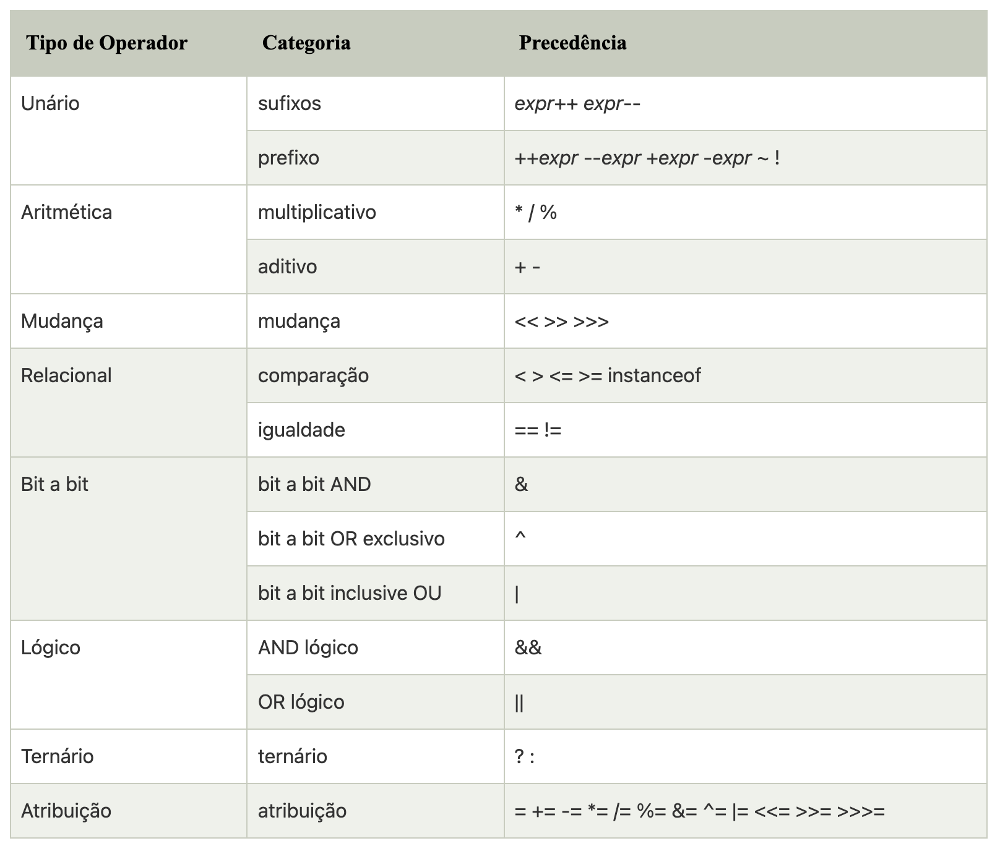

# REVISANDO TODO O ASSUNTO

### JAVA

1. Ponto de Entrada em Java.

- Ponto de entrada é nome que se dá para a função/procedimento que inicializa a execução de um programa.
Em Java, é comum chamar o ponto de entrada de “classe executável”.
Para uma classe ser executável ela precisa declarar um método chamado main com as seguintes características:

    - público
    - estático
    - retorno void
    - receber como parâmetro um vararg ou array de String

- Um projeto java nada mais é do que diversas classes e arquivos auxiliares.

- Um jar, por exemplo, é um monte de .class em um arquivo zip (basicamente).

- A maquina virtual java precisa de duas coisas para executar:

    - primeiro precisamos saber qual é a classe que vai ser executada ( e, no caso, o metodo publico, estatico main vai ser chamado )

    - segundo precisamos do classpath, que diz a maquina virtual onde procurar pelo codigo ( os .class ).

2. Exemplo de programa em Java e explique os atributos presentes.

    public class OlaMundo {
      
      public static void main(String[] args) {
        System.out.println("Olá, Mundo!"); //Imprime na tela a frase  
      }
    }

- public: É visto em qualquer lugar da aplicação;

- static: É iniciado automaticamente pela JVM, sem precisar de uma instância;

- void: Método sem retorno (retorno vazio);

- main: Nome do método, que é obrigatorio ser este. Recebe como parâmetro um array de String.

- String[] args: Array de argumentos que podem ser repassados na chamada do programa.

3. Palavras Reservadas (https://www.devmedia.com.br/o-que-significa-cada-palavra-reservada/8320)

- Modificadores de acesso:

    - **private**: acesso apenas dentro da classe

    - **protected**: acesso por classes no mesmo pacote e subclasses

    - **public**: acesso de qualquer classe

- Modificadores de classes, variáveis ou métodos:

    - **abstract**: classe que não pode ser instanciada ou método que precisa ser implementado por uma subclasse não abstrata

    - **class**: especifica uma classe

    - **extends**: indica a superclasse que a subclasse está estendendo

    - **final**: impossibilita que uma classe seja estendida, que um método seja sobrescrito ou que uma variável seja reinicializada

    - **implements**: indica as interfaces que uma classe irá implementar

    - **interface**: especifica uma interface

    - **native**: indica que um método está escrito em uma linguagem dependente de plataforma, como o C

    - **new**: instancia um novo objeto, chamando seu construtor

    - **static**: faz um método ou variável pertencer à classe ao invés de às instâncias

    - **strictfp**: usado em frente a um método ou classe para indicar que os números de ponto flutuante seguirão as regras de ponto flutuante em todas as expressões

    - **synchronized**: indica que um método só pode ser acessado por uma thread de cada vez

    - **transient**: impede a serialização de campos

    - **volatile**: indica que uma variável pode ser alterada durante o uso de threads

- Controle de fluxo dentro de um bloco de código

    - **break**: sai do bloco de codigo em que ele está

    - **case**: executa um bloco de código dependendo do teste do switch

    - **continue**: pula a execução do código que viria após essa linha e vai para a próxima passagem do loop

    - **default**: executa esse bloco de codigo caso nenhum dos teste de switch-case seja verdadeiro

    - **do**: executa um bloco de código uma vez, e então realiza um teste em conjunto com o while para determinar se o bloco deverá ser executado novamente

    - **else**: executa um bloco de código alternativo caso o teste if seja falso

    - **for**: usado para realizar um loop condicional de um bloco de código

    - **if**: usado para realizar um teste lógico de verdadeiro o falso

    - **instanceof**: determina se um objeto é uma instância de determinada classe, superclasse ou interface

    - **return**: retorna de um método sem executar qualquer código que venha depois desta linha (também pode retornar uma variável)

    - **switch**: indica a variável a ser comparada nas expressões case

    - **while**: executa um bloco de código repetidamente enquanto a condição for verdadeira

- Tratamento de erros

    - **assert**: testa uma expressão condicional para verificar uma suposição do programador

    - **catch**: declara o bloco de código usado para tratar uma exceção

    - **finally**: bloco de código, após um try-catch, que é executado independentemente do fluxo de programa seguido ao lidar com uma exceção

    - **throw**: usado para passar uma exceção para o método que o chamou

    - **throws**: indica que um método pode passar uma exceção para o método que o chamou

    - **try**: bloco de código que tentará ser executado, mas que pode causar uma exceção

- Controle de pacotes

    - **import**: importa pacotes ou classes para dentro do código

    - **package**: especifica a que pacote todas as classes de um arquivo pertencem

- Primitivos

    - **boolean**: um valor indicando verdadeiro ou falso

    - **byte**: um inteiro de 8 bits (signed)

    - **char**: um caracter unicode (16-bit unsigned)

    - **double**: um número de ponto flutuante de 64 bits (signed)

    - **float**: um número de ponto flutuante de 32 bits (signed)

    - **int**: um inteiro de 32 bits (signed)

    - **long**: um inteiro de 64 bits (signed)

    - **short**: um inteiro de 32 bits (signed)

- Variáveis de referência

    - **super**: refere-se a superclasse imediata

    - **this**: refere-se a instância atual do objeto

- Retorno de um método

    - **void**: indica que o método não tem retorno

- Palavras reservadas não utilizadas

    - **const**: Não utilize para declarar constantes; use public static final

    - **goto**: não implementada na linguagem Java por ser considerada prejudicial

4. Conceitue os Tipos de Dados em Java. (https://www.devmedia.com.br/tipos-de-dados-por-valor-e-por-referencia-em-java/25293)

- Tipos de dados são especificados de diferentes tamanhos e valores que podem ser armazenados na variável. Existem dois tipos de dados em java:

    - **Tipo de dado primitivo**: Incluem boolean, char, byte, short, int, long, float, e double.

    - **Tipo de dado não primitivo**: Incluem classes, interfaces e arrays.

- Java é uma linguagem de programação estaticamente tipada. Isso significa, que todas as variáveis dever ser declaradas antes de serem usadas. É por isso que precisamos declarar o tipo e o nome da variável.

- Existem oito tipos de tipo de **dado primitivo**:

    - Tipo de dado **boolean**

    - Tipo de dado **byte**

    - Tipo de dado **char**

    - Tipo de dado **short**

    - Tipo de dado **int**

    - Tipo de dado **long**

    - Tipo de dado **float**

    - Tipo de dado **double**

- Tipo de dado **boolean**.

    - O tipo de dado boolean é usado para armazenar somente dois possíveis valores: verdadeiro e falso. Este tipo de dado é usado por sinalizadores simples que localizam condições verdadeira/falsa.

    - Especifica um bit de informação, mas o "tamanho" não pode ser especificado precisamente. Exemplo: boolean one = false

- Tipo de dado **byte**.

    - É um exemplo de um tipo de dado primitivo. É um inteiro de complemento de dois com assinatura de 8 bits. Sua faixa de valor está entre -128 até 127 (inclusive). Valor mínimo é -128 e o valor máximo é 127. Seu valor padrão é 0 (zero).

    - O tipo de dado byte é usado para salvar em memória grandes matrizes onde a memória salva é muito requisitada. Isso economiza espaço porque um byte é quatro vezes menor que um número inteiro. Também pode ser usado no lugar de tipos de dados "int". Exemplo: byte a = 10, byte b = -20.

- Tipo de dado **short**.

    - O tipo de dado short é um inteiro de complemento de dois com assinatura de 16 bits. Sua faixa de valor está entre -32.768 até 32.767 (inclusive). Seu valor mínimo é -32.768 e valor máximo é 32.767. Seu valor padrão é 0 (zero).

    - O tipo de data short também pode ser usado para economizar memória assim como o tipo de dado byte. Um tipo de dado short é duas vezes menor que um inteiro. Exemplo: short s = 10000, short r = -5000

- Tipo de dado **int**.

    - O tipo de dado int é um inteiro de complemento de dois com assinatura de 32 bits. Sua faixa de valor está entre -2.147.483.648 (-2³¹) até 2.147.483.647 (2³¹?¹) (inclusive). Seu valor mínimo é -2.147.483.648 e valor máximo é 2.147.483.647. Seu valor padrão é 0 (zero).

    - O tipo de dado int geralmente é usado como um tipo de dado padrão para valores inteiros sem nenhum problema de memória. Exemplo: int a  = 100000, int b = -200000.

- Tipo de dado **long**.

    - O tipo de dado long é um inteiro de complemento de dois com assinatura de 64 bits. Sua faixa de valor está entre -9.223.372.036.854.775.808 (-2?³) até 9.223.372.036.854.775.807 (2?³?¹) (inclusive). Seu valor mínimo é -9.223.372.036.854.775.808 e o valor máximo é de 9.223.372.036.854.775.807. O valor padrão é 0 (zero).
    
    - O tipo de dado long é usado quando você precisa de uma faixa de valores maior do que a fornecida por int. Exemplo: long a = 100000L, long b = -200000L.

- Tipo de dado **float**.

    - O tipo de dado float é um ponto flutuante IEEE 754 de 32 bits de precisão única. Sua faixa de valor é ilimitada. É recomendado usar um ponto flutuante (em vez de double) se você precisar economizar memória em grandes arrays (matrizes) de número de ponto flutuante.
    
    - O tipo de dado float nunca deve ser usado para valores precisos, como moeda. Seu valor padrão é 0.0f. Exemplo: float f1 = 234.5f

- Tipo de dado **double**.

    - O tipo de dado double é um ponto flutuante IEEE 754 de 64 bits de precisão dupla. Seu valor é ilimitado. O tipo de dado double é geralmente usado para valores decimais assim como float.
    
    - O tipo de dado double também não deve ser usado para precisar valores, como moeda. Seu valor padrão é 0.0d. Exemplo: double d1 = 12.3

- Tipo de dado **char**.

    - O tipo de dado char é um único caractere unicode de 16 bits. Sua faixa de valor está entre '\u0000' (ou 0) até '\uffff' (ou 65.535 inclusive).
    
    - O tipo de data char é usado para para armazenar caracteres. Exemplo: char letraA = 'A'

- Variáveis:

    - Uma variável representa a unidade básica de armazenamento temporário de dados e compõe-se de um tipo, um identificador e um escopo. Seu objetivo é armazenar um dado de determinado tipo primitivo para que possa ser recuperado e aplicado em operações posteriores.

    - Para compreender como funciona o uso de variáveis é preciso analisar como elas são criadas, de que modo recebem e armazenam dados e como estes são recuperados. Também é importante entender onde elas podem ser declaradas e onde podem ser utilizadas, tendo em vista seu escopo.

- CONSTANTES:

    - As constantes são unidades básicas de armazenamento de dados que não devem sofrer alterações ao longo da execução do aplicativo. O uso de constantes é menos frequente que o uso de variáveis. No entanto, há situações em que elas são requeridas e, por isso, é indispensável entender o que são, para que servem e como podem ser utilizadas.

    - A declaração de uma constante contém apenas um elemento a mais que a declaração de uma variável: a palavra reservada final. Assim como as variáveis, as constantes compõem-se de um tipo, um identificador e um escopo. Veja a sintaxe que determina como declarar e inicializar uma constante:

    - final < tipo > < identificador > = < valor >;

    - static final < tipo > < identificador > = < valor >;

    - Mas enquanto a declaração e a inicialização de variáveis podem ser feitas em instruções distintas, toda constante deve ser declarada e inicializada em uma única instrução e, depois disso, não lhe pode ser atribuído outro valor.

    - Além de tudo que foi dito sobre constantes, é importante observar uma convenção no momento de declará-las: devem ser utilizadas somente letras maiúsculas para seu identificador. A aderência a essa convenção torna o código-fonte muito mais legível, facilitando a distinção entre variáveis e constantes.

### OO

5. Explique o que é Classes em Java.

- Um objeto em Java é a entidade física e lógica, enquanto uma classe em Java é apenas uma entidade lógica.

- Uma classe é um grupo de objetos que possuem propriedades comuns. É um modelo ou blueprint a partir do qual os objetos são criados. É uma entidade lógica. Não pode ser físico.

- Uma classe Java pode conter:

    - Variáveis
    
    - Métodos
    
    - Construtores
    
    - Blocos
    
    - Classe e interface

- Variável de instância em Java

    - Uma variável criada dentro da classe, mas fora do método, é conhecida como variável de instância (ou variável global). A variável de instância não obtém memória no momento da compilação. Ele obtém memória no tempo de execução quando um objeto ou instância é criado. É por isso que é conhecida como uma variável de instância.

- Método em Java

    - Em Java, um método é como uma função usada para expor o comportamento de um objeto.

    - Vantagem do método:

        - Reutilização de código

        - Otimização de código

- Palavra reservada **new**

    - A palavra-chave new é usada para alocar memória em tempo de execução. Todos os objetos recebem memória na área de memória Heap.

- Exemplo de classe:

      package javamundo;

      public class SerHumano {
          
          // Atributos da classe ser humano
          public String nome;
          public int idade;
          public String CorDosOlhos;
          public String CorDosCabelos;
      }

- Exemplo de código com métodos:

        package javamundo;

        public class SerHumano {
            
        // Atributos da classe ser humano
            public String nome;
            public int idade;
            public String CorDosOlhos;
            public String CorDosCabelos;
            
        // Métodos da classe ser humano
            public void falar(){
                System.out.println("Oi! Eu sou um ser humano.");
            }  
            
            public void dormir(){
                System.out.println("zZzZzZzzz!!!");
            }  
        }

- Atributos = Características que definem a classe.

- Métodos = São as tarefas, ações que a classe pode executar.

6. Explique o que é objeto em Java.

- Uma entidade que possui estado e comportamento é conhecida como um objeto, por exemplo, cadeira, bicicleta, marcador, caneta, mesa, carro, etc. Pode ser física ou lógica (tangível e intangível). O exemplo de um objeto intangível é o sistema bancário.

- Um objeto tem três características:

    - **Estado**: representa os dados (valor) de um objeto.

    - **Comportamento**: representa o comportamento (funcionalidade) de um objeto, como depósito, retirada, etc.

    - **Identidade**: uma identidade de objeto geralmente é implementada por meio de um ID exclusivo. O valor do ID não é visível para o usuário externo. No entanto, é usado internamente pela JVM para identificar cada objeto exclusivamente.

- Um objeto é uma instância de uma classe. Uma classe é um modelo ou rascunho a partir do qual os objetos são criados. Portanto, um objeto é a instância (resultado) de uma classe.

- Definições de objeto:

    - Um objeto é uma entidade do mundo real.
    
    - Um objeto é uma entidade de tempo de execução.
    
    - O objeto é uma entidade que possui estado e comportamento.
    
    - O objeto é uma instância de uma classe.

7. Explique por que isso não funciona:

        Conta c1 = new Conta();

        Conta c2 = c1;

- Os dois objetos irão acessar o mesmo método, e acredito que não tem necessidade de fazer:

        "Conta c2 = new Conta();

- Mas isso não funcionará, porque?

- Não pode ser assim pois se vc por ventura modificar um atributo de um dos objetos isso ira refletir no outro…

- ambos tem o mesmo endereço de memoria… se vc mandar imprimir com o System.out.println os Objetos verá que terão o mesmo endereço…

- por isso vc tem que criar 2 referencias distintas para cada objeto.

8. Manipule datas em Java.

- Para quem está começando, trabalhar com datas em Java pode ser um pouco complicado, já que a classe Date não fornece todos os recursos necessários. Para completá-la é também utilizada a classe Calendar, que é uma classe abstrata que permite a manipulação de datas de forma mais fácil.

- Date(java.util.Date)

    - A classe Date armazena uma data e hora, que internamente é armazenada com um inteiro long que é o número de milissegundos que se passou desde 01/01/1970.

    - Esta classe é bem simples de se trabalhar, mas muitos de seus métodos foram depreciados por não trabalhar muito bem com internacionalização e etc.

    - Para obter a data atual se basta criar um objeto Date sem nenhum parâmetro.

          Date d = new Date();

- Calendar(java.util.Calendar)

    - A classe Calendar sendo uma classe abstrata não pode ser instanciada com o operador new, ela deve ser criada utilizando um operador estático sobrecarregado getInstance(). Na maioria das vezes você vai receber uma instância de java.utilGregorianCalendar.

          Calendar c = Calendar.getIntance();

    - Com a instância de Calendar devemos configurar uma data e podemos fazer isso de duas formas:

        - Métodos `set`

              c.set(ano,mes,dia);
              c.set(ano,mês,dia,hora,minuto);
              c.set(ano,mês,dia,hora,minuto,segundo);

        - Método `setTime`

              c.setTime(new Date() );

    - A classe Calendar também nos fornece várias constantes que utilizaremos para manipular uma data entre elas.

    - Com a data devidamente configurada podemos realizar diversas operações com a data:

    - Para adicionar ou subtrair um dia, hora, mês ou ano utilizamos o método add. O método add aceita dois parâmetros, sendo o primeiro um constante inteira que representa a unidade da data que queremos modificar(dia, mês , ano, etc…) e o segundo quantas vezes será adicionada/subtraída esta unidade.

    - A unidade é informada utilizando constantes fornecidas pela classe Calendar que pode ser:

        - Dia:

              Calendar.DAY_OF_MONTH
              Calendar.DAY_OF_WEEK
              Calendar.DAY_OF_YEAR

        - Mês:

              Calendar.MONTH

        - Ano:

              Calendar.YEAR

        - Hora:

              Calendar.HOUR
              Calendar.HOUR_OF_DAY

        - Segundos:

              Calendar.SECOND

    - Exemplo:

          Date d = new Date();
          Calendar c = Calendar.getInstance();
          c.add(Calendar.DAY_OF_YEAR,5 );//adicionamos 5 dias a data aual
          c.add(Calendar.MONTH,3 );//adicionamos 3 mêses a data atual
          c.add(Calendar.YEAR,1 );//adicionamos 1 ano a data atual

- DateFormat(java.text.DateFormat)

    - Bom agora sabemos como manipula datas, agora precisamos formatar a data para apresentação. A classe DateFormat nos fornece uma maneira simples de formatá-la e permite a internacionalização a partir da classe Locale.

          Date d = new Date();
          Calendar c = Calendar.getInstance();
          c.setTime(d);
            
          DateFormat df = DateFormat.getDateInstance(DateFormat.SHORT);
          System.out.println( df.format(c.getTime()) );

    - Para obtermos uma String da data utilizamos o método format que retorna uma String no formato especificado no método getDateInstance(). A saída do exemplo acima será algo como 03/04/10.

    - A classe `DateFormat` nos fornece vários tipos de formato para data como:

          Dateformat.SHORT // 03/04/10
          Dateformat.MEDIUM // 03/04/2010
          Dateformat.LONG //3 de Abril de 2010
          Dateformat.FULL //Sábado, 3 de Abril de 2010

    - Embora para muitos casos estes formatos serão suficientes algumas vezes necessitamos de uma formato bem personalizado. Isso pode ser feio através de um subclasse de `DateFormat` a `SimpleDateFormat`.

          Date hoje  = new Date();
          SimpleDateFormat sdf = new SimpleDateFormat("dd/MM/yyyy HH:mm:ss");
          System.out.println( sdf.format(hoje));

- Como vimos o dia da semana pode ser escrito por extenso, que língua ele será utilizada? Normalmente o inglês, mas se quisermos que seja na língua de um local diferente?

- Para isso utilizaremos a internacionalização com a classe Locate que recebe em seu construtor a língua e o país que queremos utilizar:

        Locale brasil = new Locale("pt","br"); //portugues do brasil
        Locale japao = new Locale("ja"); // japao

- O objeto locale de Locale pode ser utilizado tanto com a classe DateFormat quanto com a classe SimpleDateFormat.

        Date hoje  = new Date();
        SimpleDateFormat sdf = new SimpleDateFormat("E dd ",new Locale("pt","br"));
        System.out.println( sdf.format(hoje));
          
          
        DateFormat df = DateFormat.getDateInstance(DateFormat.FULL,new Locale("pt","br"));
        System.out.println( df.format(hoje));

- Para finalizar como convertermos uma String em um objeto Date.

        Date d  = new Date();
        SimpleDateFormat df = new SimpleDateFormat("DD/MM/yyyy");
        try {
          d = df.parse("25/03/2010");
        } catch (ParseException ex) {
          ex.printStackTrace();         
        }
        System.out.println( df.format(d));

- O método parse da classe DateFormat e SimpleDateFormat recebe uma string e converte para um objeto Date.

9. Cite os Métodos e atributos públicos e privados

- **public**

    - Uma declaração com o modificador public pode ser acessada de qualquer lugar e por qualquer entidade que possa visualizar a classe a que ela pertence.

- **private**

    - Os membros da classe definidos como não podem ser acessados ou usados por nenhuma outra classe. Esse modificador não se aplica às classes, somente para seus métodos e atributos. Esses atributos e métodos também não podem ser visualizados pelas classes herdadas.

- **protected**

    - O modificador protected torna o membro acessível às classes do mesmo pacote ou através de herança, seus membros herdados não são acessíveis a outras classes fora do pacote em que foram declarados.

- **default (padrão):**

    - A classe e/ou seus membros são acessíveis somente por classes do mesmo pacote, na sua declaração não é definido nenhum tipo de modificador, sendo este identificado pelo compilador.

- **final**

    - Quando é aplicado na classe, não permite estende-la, nos métodos impede que o mesmo seja sobrescrito (overriding) na subclasse, e nos valores de variáveis não pode ser alterado depois que já tenha sido atribuído um valor.

- **abstract**

    - Esse modificador não é aplicado nas variáveis, apenas n as classes. Uma classe abstrata não pode ser instanciada, ou seja, não pode ser chamada pelos seus construtores. Se houver alguma declaração de um método como abstract (abstrato), a classe também deve ser marcada como abstract.

- **static**

    - É usado para a criação de uma variável que poderá ser acessada por todas as instâncias de objetos desta classe como uma variável comum, ou seja, a variável criada será a mesma em todas as instâncias e quando seu conteúdo é modificado numa das instâncias, a modificação ocorre em todas as demais. E nas declarações de métodos ajudam no acesso direto à classe, portanto não é necessário instanciar um objeto para acessar o método.

10. Cite e exemplifique operadores em Java.

- Operador em java é um símbolo que é usado para executar operações.

- Operador Unário

    - Os operadores unários requerem apenas um operando. Operadores unários são usados para executar várias operações, ou seja:

        - Incrementando / decrementando um valor em um

        - Negando uma expressão

        - Invertendo o valor de um boolean

              public class OperadorExemplo {  
                public static void main (String args []) {  
                    int x = 10;  
                    System.out.println (x++); // 10  
                    System.out.println (x++); // 11
                    
                    System.out.println (++x); // 13  
                    System.out.println (++x); // 14
                    
                    System.out.println (x--); // 14
                    System.out.println (x--); // 13
                    
                    System.out.println (--x); // 11
                    System.out.println (--x); // 10
                }  
              }  
        
    - Outro exemplo:

          class OperadorExemplo {  
            public static void main (String args []) {  
                int a = 10;  
                int b = 10;  
                System.out.println (a++ + ++a); // 10 + 12 = 22  
                System.out.println (b++ + b++); // 10 + 11 = 21  
            }  
          }

    - Exemplo com ~ e !:

          class OperadorExemplo {  
            public static void main (String args []) {  
                int a = 10;  
                int b = -10;  
                boolean c = true;  
                boolean d = false;  
                System.out.println (~a); // - 11 (Inverte o sinal e subtrai com 1)  
                System.out.println (~b); // 9 (Inverte o sinal e subtrai com 1)  
                System.out.println (!c); // false (oposto ao valor booleano)  
                System.out.println (!d); // true  
            }  
          } 

- Operador Aritmético, exemplo:

        class OperadorExemplo {  
          public static void main (String args[]) {   
              int a =10;  
              int b = 5;  
              System.out.println (a + b); // 15  
              System.out.println (ab); // 5  
              System.out.println (a * b); // 50  
              System.out.println (a / b); // 2  
              System.out.println (a % b); // 0  
          }  
        }  

    - Exemplo com expressão:

          class OperadorExemplo {  
            public static void main (String args[]) {  
                System.out.println(10 * 10 / 5 + 3 - 1 * 4 / 2);  
            }
          }

- Operador Shift para a esquerda

    - O operador Java left shift << é usado para mudar todos os bits de um valor para o lado esquerdo de um número especificado de vezes.

          class OperadorExemplo {  
            public static void main (String args []) {  
                System.out.println (10 << 2); // 10 * 2 ^ 2 = 10 * 4 = 40  
                System.out.println (10 << 3); // 10 * 2 ^ 3 = 10 * 8 = 80  
                System.out.println (20 << 2); // 20 * 2 ^ 2 = 20 * 4 = 80  
                System.out.println (15 << 4); // 15 * 2 ^ 4 = 15 * 16 = 240  
            }  
          }  

- Operador Shift para a direita

    - O operador Java right shift >> é usado para mover os operandos da esquerda para a direita pelo número de bits especificado pelo operando da direita.

          class OperadorExemplo {  
            public static void main (String args []) {  
                System.out.println (10 >> 2); // 10 / 2 ^ 2 = 10 / 4 = 2  
                System.out.println (20 >> 2); // 20 / 2 ^ 2 = 20 / 4 = 5  
                System.out.println (20 >> 3); // 20 / 2 ^ 3 = 20 / 8 = 2  
            }  
          }  

- Operador AND: Lógico && e Bitwise &

    - O operador lógico && não verifica a segunda condição se a primeira condição for falsa. Ele verifica a segunda condição apenas se a primeira for verdadeira.

    - O operador bit a bit & sempre verifica as duas condições se a primeira condição é verdadeira ou falsa.

          class OperadorExemplo {  
            public static void main (String args []) {  
                int a =10;  
                int b = 5;  
                int c = 20;  
                System.out.println (a < b && a < c); // falso && verdadeiro = falso  
                System.out.println (a < b & a < c); // falso & verdadeiro = falso  
            }  
          } 

- Operador AND: Lógico && vs Bitwise &

      class OperadorExemplo {  
        public static void main (String args []) {  
            int a =10;  
            int b = 5;  
            int c = 20;  
            System.out.println(a < b && a++ < c); // falso && verdadeiro = falso  
            System.out.println(a); // 10 porque a segunda condição não está marcada  
            System.out.println(a < b & a++ < c); // falso && verdadeiro = falso  
            System.out.println(a); // 11 porque a segunda condição está marcada  
        }  
      } 

- Operador OR: Lógico || e bit a bit |

    - O operador lógico || não verifica a segunda condição se a primeira condição for verdadeira. Ele verifica a segunda condição apenas se a primeira for falsa.

    - O operador bit a bit | sempre verifica as duas condições se a primeira condição é verdadeira ou falsa.

          class OperadorExemplo {  
            public static void main (String args []) {  
                int a = 10;  
                int b = 5;  
                int c = 20;  
                System.out.println(a > b || a < c); // true || true = true  
                System.out.println(a > b | a < c); // true | true = true  
                // ||vs |  
                System.out.println (a > b || a ++ < c); // true || true = true  
                System.out.println (a); // 10 porque a segunda condição não está marcada  
                System.out.println (a > b | a ++ < c); // true | true = true  
                System.out.println (a); // 11 porque a segunda condição está marcada  
            }  
          }  

- Operador Ternário

    - O operador ternário é usado como um substituto para a instrução if-then-else e muito usado na programação Java. É o único operador condicional que leva três operandos.

          class OperadorExemplo {  
            public static void main (String args []) {  
                int a = 2;  
                int b = 5;  
                int min = (a < b) ? a : b;  
                System.out.println(min);  // 2
            }  
          }  

    - Outro exemplo:

          class OperadorExemplo {  
            public static void main (String args []) {  
                int a = 10;  
                int b = 5;  
                int min = (a < b) ? a : b;  
                System.out.println (min);  // 5
            }  
          }  

- Operador de atribuição

    - O operador de atribuição é um dos operadores mais comuns. É usado para atribuir o valor à direita ao operando à esquerda.

          class OperadorExemplo {  
            public static void main (String args []) {  
                int a = 10;  
                int b = 20;  
                a += 4; //a = a + 4 (a = 10 + 4)  
                b -= 4; //b = b - 4 (b = 20 - 4)  
                System.out.println(a);  // 14
                System.out.println(b);  // 16
            }  
          }  

    - Outro exemplo

          class OperadorExemplo {  
            public static void main (String [] args) {  
              int a = 10;  
              a += 3; // 10 + 3  
              System.out.println(a); 

              a -= 4; // 13 - 4  
              System.out.println(a); 

              a *= 2; // 9 * 2  
              System.out.println(a);  

              a /= 2; // 18 / 2  
              System.out.println(a);  
            }  
          }  

- Operador de atribuição: Adicionando short

      class OperadorExemplo {  
        public static void main (String args []) {  
          short a = 10;  
          short b = 10;  
          //a += b; //a = a + b internamente tem o mesmo resultado  
            a = a + b; // Erro em tempo de compilação porque 10 + 10 = 20 agora int  
            System.out.println(a);  
        }  
      }  

- Após alteração no tipo:

      class OperadorExemplo {  
        public static void main (String args []) {  
            short a =10;  
      short b =10;  
      a = (short) (a + b); // 20, que agora é convertido para short  
      System.out.println(a);  
        }  
      }  

11. Explique e exemplifique estruturas condicionais e estruturas de repetição em Java.

- As estruturas condicionais possibilitam ao programa tomar decisões e alterar o seu fluxo de execução.

- As estruturas condicionais geralmente analisam expressões booleanas e, caso estas expressões sejam verdadeiras, um trecho do código é executado. No caso contrário, outro trecho do código é executado.

    - **IF/ELSE**

        - O if/else é uma estrutura de condição em que uma expressão booleana é analisada. Quando a condição que estiver dentro do if for verdadeira, ela é executada. Já o else é utilizado para definir o que é executado quando a condição analisada pelo if for falsa. Caso o if seja verdadeiro e, consequentemente executado, o else não é executado.