# BANCO DE DADOS RELACIONAL - SQL

### PostgreSQL

Feito com `Marp` plugin do `VS Code`


<!-- _footer: 'Por Marianne Salomão' -->

---

<!--
_backgroundColor: gray
_color: #FDF5E6
-->


# 🌎 MARIANNE SALOMÃO 

- Comecei minha trajetória no campus da Universidade de Brasília (UnB), cursando Engenharia
- Cloud Engineer na IBM Brasil
- @ [Instagram](https://www.instagram.com/mariannesalomao/)
- ⚒ [LinkedIn](https://www.linkedin.com/in/mariannesalomao/)
- ⚛︎ [GitHub](https://github.com/mariannesalomao)

---

# Dados

- Se você enviou um e-mail hoje, escreveu um post no Facebook
ou no Twitter, ou enviou uma mensagem de celular, essas
informações que você publicou ficaram lá armazenadas. E esse
armazenamento é feito em umbanco de dados.

---

# Dados

- Estamos conectados a diversos bancos de dados diariamente.

- Eles estão no computador, no celular, no tablet , no videogame e em
até em alguns eletrodomésticos como algumas geladeiras modernas
que salvam listas de compras.

- O conceito básico de SGBD relacional é um conjunto de tabelas
relacionadas, e estas são compostas por alguns elementos básicos:
colunas, linhas e campos.

---

# Dados

- Nos primórdios os dados eram armazenados na própria aplicação, e isso pode ser um problema gigantesco, exemplo de um dos problemas dessa "arquitetura": para indexar e reindexar dados podia gerar perda de algum dado. 

- O SQL foi desenvolvido originalmente no início dos anos 70 nos laboratórios da IBM em San Jose, dentro do projeto System R, que tinha por objetivo demonstrar a viabilidade da implementação do modelo relacional proposto por E. F. Codd.

- Embora o SQL tenha sido originalmente criado pela IBM, rapidamente surgiram vários "dialetos" desenvolvidos por outros produtores.

---

# SQL (Linguagem de Consulta Estruturada)

- Independentemente do aplicativo que se deseja usar para o armazenamento
e manipulação das informações, todos os bancos de dados são constituídos
por elementos básicos: **campos, colunas, linhas ou tuplas e tabelas**.

- **Campos** são os espaços reservados para inserção de um determinado dado;
as **colunas** são os registros de um determinado campo; as tuplas são as linhas
de registros de um conjunto de campos; e as **tabelas** são os conjuntos de linhas,
campos e colunas.

- Cada banco é um conjunto de tabelas relacionadas. Também são chamados
de relações, daí o nome banco de dados relacional. Cada tabela é uma
representação física de uma entidade ou objeto que está em um formato tabular.

---

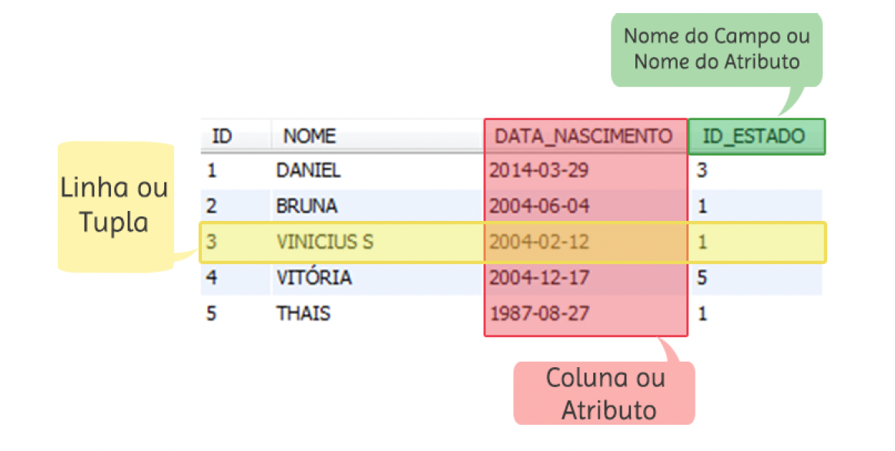

---

# **1. MODELO ENTIDADE/RELACIONAMENTO**

  - A **entidade** seria a nossa tabela, os dados são armazenados de forma tabular. Ex: Carro e seus atributos

  - O **relacionamento** está relacionado à relação que tal tabela tem com outra. Ex: Produtos está relacionado a um cliente.

---

# **2. CHAVE PRIMÁRIA**

  - Única, não muda, não vazia.

  - Você deve ter uma chave primária, pois será um registro que
não sofrerá alteração e nem se repetirá. Sempre será único e
imutável. Só assim você terá a consistência de seus dados. Para
alterar um registro na tabela, você deve buscá-lo por sua PK, assim
não ocorrerá de alterar um registro incorreto.

---

# **3. SQL**

  - **DML Linguagem de Manipulação de Dados**: 
  
      - Esses comandos indicam
    uma ação para o SGBD executar. Utilizados para recuperar, inserir
    e modificar um registro no banco de dados. Seus comandos são:
    `INSERT`, `DELETE`, `UPDATE`, `SELECT` e `LOCK`;

---

# **3. SQL**

  - **DDL Linguagem de Definição de Dados:**:

      - Comandos DDL são responsáveis
    pela criação, alteração e exclusão dos objetos no banco de dados.
    São eles: `CREATE TABLE`, `CREATE INDEX`, `ALTER TABLE`, `DROP TABLE`, `DROP VIEW` e `DROP INDEX`;

---

# **3. SQL**

  - **DCL Linguagem de Controle de Dados:**

      - Responsável pelo controle de
    acesso dos usuários, controlando as sessões e transações do SGBD. Alguns
    de seus comandos são: `COMMIT`, `ROLLBACK`, `GRANT` e `REVOKE`.

---

# **4. PL/PGSQL**

  - Se você trabalha ou já trabalhou com o Oracle, sabe o que é o
PL/SQL. É a linguagem procedural do banco de dados Oracle que
permite a inclusão de lógica no SGBD. Já o PL/pgSQL (Procedural
Language/PostgreSQL) é a linguagem de programação procedural do
PostgreSQL. Com ela, é possível inserir lógica em seu banco de
dados.

---

# **4. PL/PGSQL**

- Neste momento, você deve estar se perguntando por que
precisaríamos de lógica ou de uma linguagem para trabalhar com
banco de dados, já que os comandos SQL conseguem apenas
manipular os dados seu em SGBD. Explicarei o porque mais a frente.

---

# **4. PL/PGSQL**

- PL/pgSQL é uma linguagem procedural que você grava no
sistema de banco de dados PostgreSQL. Os objetivos do PL/pgSQL
foram criar uma linguagem procedural carregável que pode ser
usada para criar funções e procedimentos de gatilhos, acrescentar
estruturas de controle à linguagem SQL, poder realizar cálculos
complexos, e herdar todos os tipos, funções e operadores definidos
pelo usuário. Ela pode ser definida para ser confiável para o servidor
e ser fácil de usar.

---

# **4. PL/PGSQL**

- Funções criadas com PL/pgSQL podem ser usadas em qualquer
lugar em que funções internas são utilizadas. Por exemplo, é
possível criar funções de cálculo condicional complexos e depois
usá-las em chamadas de triggers.

---

# **5. DATATYPES**

- Cada informação deve ser armazenada com o seu tipo correto.
Isto é, um campo em que serão inseridos apenas números deverá ser
do tipo numérico. É extremamente importante e crítico fazer a
escolha do tipo de cada informação que você vai armazenar.

---

# 5. DATATYPES

## Campos do tipo **STRING**

- `varying(n)` variável do tipo string, limite entre parênteses.

- `varchar(n)` tipo de variável padrão para o tipo string, limite entre parênteses.

- `character(n)` tipo de variável string

- `char(n)` tipo de string que possui tamanho fixo, entre parênteses deve ser informado o número de caracteres.

- `text` variável de tamanho ilimitado (Ex: textos, descrição, observação)

---

# 5. DATATYPES

## Campos do tipo **Boolean**


  - São utilizadas para ver se tal expressão é verdadeira ou falsa. Veremos na prática adiante.

---

# 5. DATATYPES

## Campos do **Tipo Numérico**

- `smallint` capacidade de 2 bytes de armazenamento e pequena variação. Suporta números inteiros de -32768 até +32767.

- `integer` capacidade de 4 bytes de armazenamento, principal escolha para utilizar em campos numéricos inteiros.

- `bigint` capacidade de 8 bytes de armazenamento.

- `decimal` tipo numérico usado especificamente quando precisar armazenar números com precisão decimal.

---

# 5. DATATYPES

## Campos do **Tipo Numérico**

- `numeric` também usado quando precisar armazenar números com precisão decimal.

- `real` capacidade de 4 bytes de armazenamento. Esse tipo de campo armazena números reais e com até 6 dígitos decimais.

- `double` capacidade de 8 bytes de armazenamento. Pode armazenar até 15 dígitos nas casas decimais.

---

# 5. DATATYPES

## Campos do **Tipo Numérico**

- `smallserial` capacidade de 2 bytes de armazenamento. Este campo é um que se autoincrementa. Armazena inteiros de 1 até 32767

- `serial` capacidade de 4 bytes de armazenamento, também é um campo de autoincremento, é maior que o anterior.

- `bigserial` capacidade de 8 bytes de armazenamento.

---

# 5. DATATYPES

## **Campo Autoincremental**

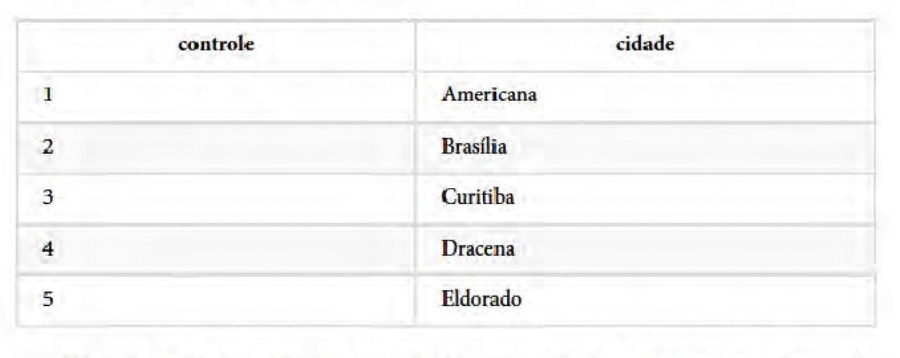

---

# 5. DATATYPES

## **Campo Autoincremental**

- Eu não precisei inserir registro no campo `controle` pois ele é autoincremental. O id segue esse princípio, se autoincrementa a cada novo registro.

- São campos que possuem a capacidade de aumentar automaticamente. A cada novo registro na tabela, ele soma +1 ao número anterior e insere no campo.

---

# 5. DATATYPES

## **Campos do Tipo Data**

- `timestamp` capacidade de armazenamento de 8 bytes. Armazena data e hora.

- `date` capacidade de armazenamento de 4 bytes. Armazena apenas data.

- `time` capacidade de armazenamento de 8 bytes. Armazena apenas hora.

---

# 5. DATATYPES

## **Campos do Tipo Full Text Search**

- Nesse contexto, os tipos usados para Full Text Search (FTS) são eles:

- `tsvector` tipos de dados que representa um documento, como uma lista ordenada e com posições no texto.

- `tsquery` tipo de dado para busca textual que suporta operadores booleanos.

---

# 5. DATATYPES

## **Tipo XML**

- XML, ame ou odeie. Há uma grande quantidade de dados em
formatos XML, e esse fato não está mudando rapidamente devido a
um grande investimento em XML. Ocasionalmente, inserir dados
XML em um banco de dados relacional pode render uma vitória
quando a integração com fontes de dados externas fornece dados
em XML.

- PostgreSQL tem a capacidade de manipular dados XML com
SQL, permitindo um caminho para integrar dados XML em
consultas SQL. A declaração deste tipo de campo é como a dos
outros tipos.

---

# 5. DATATYPES

## **Tipo JSON**

- PostgreSQL tem suporte a JSON já algum tempo, foi adicionado a funcionalidade para armazenar
JSON como JSON Binário (JSONB), que remove os espaços em
branco insignificantes (não que seja um grande negócio), acrescenta
um pouco de sobrecarga quando inserir dados, mas fornece um
benefício enorme ao consultar.

---

# 5. DATATYPES

## **Tipo Array**

- `integer[n]` array do tipo inteiro.

- `varchar[n][n]` array do tipo varchar bidimensional n por n.

- `double array` array do tipo double unidimensional de tamanho indefinido.

---

# 5. DATATYPES

## **Tipos Personalizados**

- É possível criar tipos de dados personalizados pelo comando `create type`, no qual podemos criar um novo tipo de
campo. Ele pode ser composto por vários campos, ou pode ser uma lista de valores.

---

# 7. CHAVE ESTRANGEIRA

- As chaves estrangeiras, ou foreign-keys, são identificadores
únicos que fazem referência à chave primária de outra tabela. Se
tivermos uma FK em nossa tabela, não conseguimos inserir um
registro que não esteja contido na tabela referenciada.

- O exemplo a seguir mostra duas tabelas: uma de funcionários e
uma de cargos. O ID da tabela CARGOS , que é uma chave primária, passa a ser uma chave estrangeira na tabela
FUNCIONARIOS , chamada CARGO_ID . Ela, por sua vez, não vai
permitir a inserção de nenhum cargo que não esteja cadastrado na
tabela CARGOS , dando para sua tabela consistência e evitando erros.

---

# 8. CRIANDO TABELAS

- Abra o terminal de comandos instalado na instalação do
PostgresSQL para criarmos os objetos em nosso banco.
O `create table` é o comando usado para criar tabelas.
Sabendo disso, vamos à criação delas.

- Após criadas todas as nossas tabelas, para você ver se realmente
estão criadas no banco de dados, utilize o comando `\dt`.

---

# 9. CONSTRAINTS

- Os tipos de dados são uma forma para limitar o tipo de dados
que pode ser armazenado em uma tabela. Para muitas aplicações,
contudo, a restrição que eles fornecem é demasiadamente grosseira.

- Por exemplo, uma coluna contendo preços de produtos
provavelmente só pode aceitar valores positivos. Mas não há
nenhum tipo de dados padrão que aceite apenas números positivos.
Outra questão é que você pode querer restringir os dados de uma
coluna com relação a outras colunas ou linhas, tabela contendo informações sobre o produto deve haver apenas uma linha para cada número de produto.

---

# 9. CONSTRAINTS

- Assim, o SQL permite definir restrições em colunas e tabelas.
Restrições darão tanto controle sobre os campos como em suas
tabelas, como você desejar. Se um usuário tentar armazenar dados
em uma coluna que possa violar uma restrição, será gerado um erro.

---

<!--
_backgroundColor: #FF7F50
_color: #FDF5E6
-->

# CRIAÇÃO DE TABELAS

---

```sql
CREATE TABLE clima (
 cidade varchar(80),
 temp_min int, -- temperatura mínima
 temp_max int, -- temperatura máxima
 prcp real, -- precipitação
 data date
);
```

- Este comando pode ser digitado no psql com quebras de linha. O psql reconhece que o comando só termina quando é encontrado o ponto-e-vírgula.

---

- No segundo exemplo são armazenadas cidades e suas localizações geográficas associadas: 

```json
CREATE TABLE cidades (
 nome varchar(80),
 localizacao point
);
```

- O tipo point é um exemplo de tipo de dado específico do PostgreSQL.

- Para terminar deve ser mencionado que, quando a tabela não é mais necessária, ou se deseja recriá-la de uma forma
diferente, é possível removê-la por meio do comando: 

```json
DROP TABLE nome_da_tabela;
```

---

<!--
_backgroundColor: #FF7F50
_color: #FDF5E6
-->

# INSERÇÃO DE LINHAS EM TABELAS

---

- É utilizado o comando `INSERT` para inserir linhas nas tabelas:

```json
INSERT INTO clima VALUES ('São Francisco', 46, 50, 0.25, '1994-11-27');
```

-  O tipo point requer um par de coordenadas como entrada, como mostrado abaixo:

```json
INSERT INTO cidades VALUES ('São Francisco', '(-194.0, 53.0)');
```

- A sintaxe usada até agora requer que seja lembrada a ordem das colunas. Uma sintaxe alternativa permite declarar as
colunas explicitamente: 

```json
INSERT INTO clima (cidade, temp_min, temp_max, prcp, data)
 VALUES ('São Francisco', 43, 57, 0.0, '1994-11-29');
```

---

- Se for desejado, pode-se declarar as colunas em uma ordem diferente, e pode-se, também, omitir algumas colunas. Por
exemplo, se a precipitação não for conhecida: 

```json
INSERT INTO clima (data, cidade, temp_max, temp_min)
 VALUES ('1994-11-29', 'Hayward', 54, 37);
```

---

<!--
_backgroundColor: #FF7F50
_color: #FDF5E6
-->

# CONSULTAR TABELAS

---

- Para trazer os dados de uma tabela, a tabela deve ser consultada. Para esta finalidade é utilizado o comando SELECT do
SQL. Este comando é dividido em lista de seleção (a parte que especifica as colunas a serem trazidas), lista de tabelas (a
parte que especifica as tabelas de onde os dados vão ser trazidos), e uma qualificação opcional (a parte onde são
especificadas as restrições).

- Por exemplo, para trazer todas as linhas da tabela clima digite: 

```sql
SELECT * FROM clima;
```

- Seriam obtidos os mesmos resultados usando:

```sql
SELECT cidade, temp_min, temp_max, prcp, data FROM clima;
```

---


---

- Na lista de seleção podem ser especificadas expressões, e não apenas referências a colunas.

```sql
SELECT cidade, (temp_max+temp_min)/2 AS temp_media, data FROM clima;
```

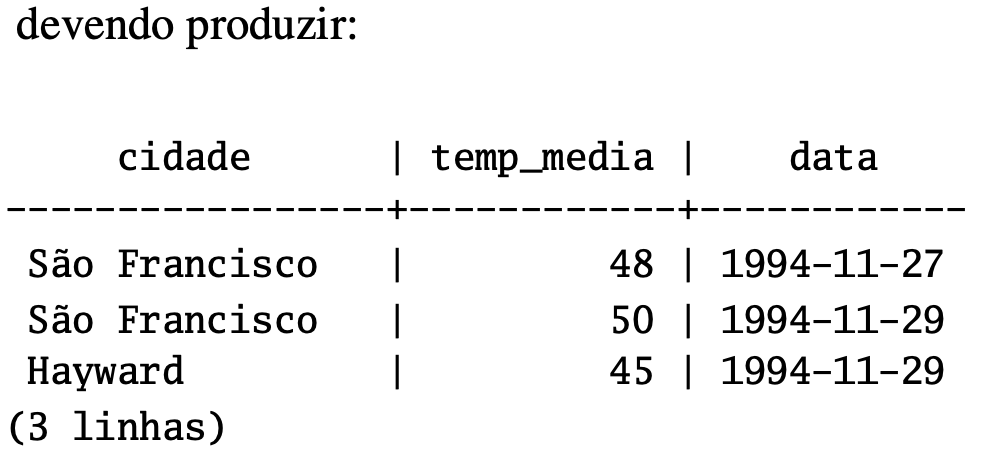

---

- Perceba que a cláusula `AS` foi utilizada para mudar o nome da coluna de saída (a cláusula AS é opcional). 

- A consulta pode ser “qualificada”, adicionando a cláusula `WHERE` para especificar as linhas desejadas. A cláusula `WHERE` contém expressões booleanas (valor verdade), e somente são retornadas as linhas para as quais o valor da expressão booleana for verdade.

- São permitidos os operadores booleanos usuais (`AND`, `OR` e `NOT`) na qualificação. Por exemplo, o comando abaixo retorna os registros do clima de São Francisco nos dias de chuva: 

```sql
SELECT * FROM clima
WHERE cidade = 'São Francisco' AND prcp > 0.0;
```

---

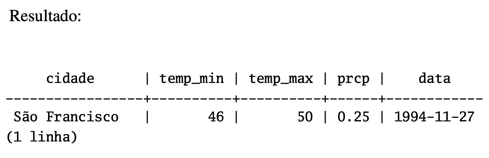

- Pode ser solicitado que os resultados da consulta sejam retornados em uma determinada ordem: 

```sql
SELECT * FROM clima
ORDER BY cidade;
```

---

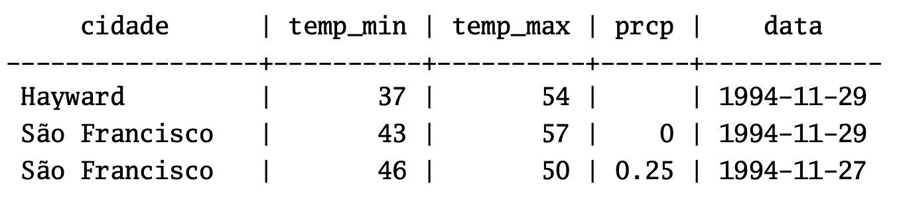

---

- Pode ser solicitado que as linhas duplicadas sejam removidas do resultado da consulta:

```sql
SELECT DISTINCT cidade
 FROM clima;
```
- Resultado:

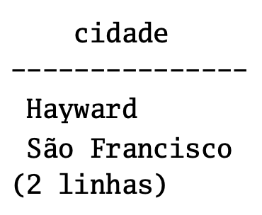

---

- Novamente, neste exemplo a ordem das linhas pode variar. Pode-se garantir resultados consistentes utilizando DISTINCT
e ORDER BY juntos.

```sql
SELECT DISTINCT cidade
 FROM clima
 ORDER BY cidade;
```

---

<!--
_backgroundColor: #FF7F50
_color: #FDF5E6
-->

# JUNÇÕES ENTRE TABELAS

---

-  Até agora as consultas somente acessaram uma tabela de cada vez.

- As consultas podem acessar várias tabelas de uma vez, ou acessar a mesma tabela de uma maneira que várias linhas da tabela sejam processadas ao mesmo tempo.

- A consulta que acessa várias linhas da mesma tabela, ou de tabelas diferentes, de uma vez, é chamada de consulta de junção.

- Como exemplo, suponha que se queira listar todas as linhas de clima junto com a localização da cidade associada.

- Para se fazer isto, é necessário comparar a coluna cidade de cada linha da tabela clima com a coluna nome de todas as linhas da tabela cidades, e selecionar os pares de linha onde estes valores são correspondentes.

**Nota**: Este é apenas um modelo conceitual, a junção geralmente é realizada de uma maneira mais eficiente que comparar de verdade cada par de linhas possível, mas isto não é visível para o usuário.

---

- Esta operação pode ser efetuada por meio da seguinte consulta:

```sql
SELECT *
 FROM clima, cidades
 WHERE cidade = nome;
```

- Resultado:

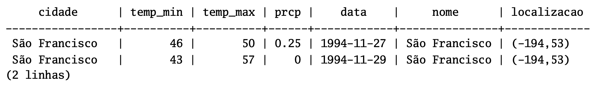

---

- Duas coisas devem ser observadas no resultado produzido: 

  - Não existe nenhuma linha para a cidade Hayward. Isto acontece porque não existe entrada correspondente na tabela cidades para Hayward, e a junção ignora as linhas da tabela clima sem correspondência. Veremos em breve como isto pode ser mudado.

  - Existem duas colunas contendo o nome da cidade, o que está correto porque a lista de colunas das tabelas clima e cidades estão concatenadas. Na prática isto não é desejado, sendo preferível, portanto, escrever a lista das colunas de saída explicitamente em vez de utilizar o `*`: 

```sql
SELECT cidade, temp_min, temp_max, prcp, data, localizacao
 FROM clima, cidades
 WHERE cidade = nome;
```

**Exercício**: Descobrir a semântica desta consulta quando a cláusula WHERE é omitida. 

---

-  Como todas as colunas possuem nomes diferentes, o analisador encontra automaticamente a tabela que a coluna pertence, mas é um bom estilo qualificar completamente os nomes das colunas nas consultas de junção:

```sql
SELECT clima.cidade, clima.temp_min, clima.temp_max,
 clima.prcp, clima.data, cidades.localizacao
 FROM clima, cidades
 WHERE cidades.nome = clima.cidade;
```

- As consultas de junção do tipo visto até agora também poderiam ser escritas da seguinte forma alternativa:

```sql
SELECT *
 FROM clima INNER JOIN cidades ON (clima.cidade = cidades.nome);
```

---

- Agora vamos descobrir como se faz para obter as linhas de Hayward.

- Desejamos o seguinte: que a consulta varra a tabela clima e, para cada uma de suas linhas, encontre a linha correspondente na tabela cidades.

- Se não for encontrada nenhuma linha correspondente, desejamos que sejam colocados “valores vazios” nas colunas da tabela cidades.

- Este tipo de consulta é chamada de junção externa (`outer join`).

- As consultas vistas até agora são junções internas (`inner join`).

- O comando então fica assim:

---

```sql
SELECT *
 FROM clima LEFT OUTER JOIN cidades ON (clima.cidade = cidades.nome);
```

- Resultado:

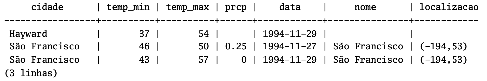

-  Esta consulta é chamada de junção externa esquerda (`left outer join`), porque a tabela mencionada à esquerda do operador de junção terá cada uma de suas linhas aparecendo na saída pelo menos uma vez, enquanto a tabela à direita terá somente as linhas correspondendo a alguma linha da tabela à esquerda aparecendo na saída. Ao listar uma linha da tabela à esquerda, para a qual não existe nenhuma linha correspondente na tabela à direita, são colocados valores vazios (null) nas
colunas da tabela à direita. 

---

**Exercício:** Existem também a junção externa direita (`right outer join`) e a junção externa completa (`full outer join`). Tente descobrir o que fazem.

---

- Também é possível fazer a junção da tabela consigo mesma.

- Isto é chamado de autojunção (`self join`).

- Como exemplo, suponha que desejamos descobrir todas as linhas de clima que estão no intervalo de temperatura de outros registros de clima.

- Para isso é necessário comparar as colunas temp_min e temp_max de cada registro de clima com as colunas temp_min e temp_max de todos os outros registros da tabela clima, o que pode ser feito utilizando a seguinte consulta:

---

```sql
SELECT C1.cidade, C1.temp_min AS menor, C1.temp_max AS maior,
 C2.cidade, C2.temp_min AS menor, C2.temp_max AS maior
 FROM clima C1, clima C2
 WHERE C1.temp_min < C2.temp_min
 AND C1.temp_max > C2.temp_max;
```

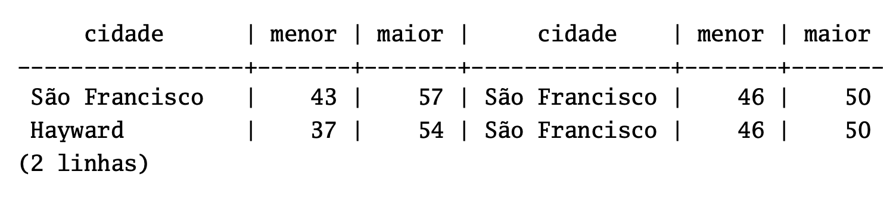

---

- A tabela clima teve seu nome mudado para C1 e C2, para permitir distinguir o lado esquerdo do lado direito da junção.

- Estes tipos de “aliases” também podem ser utilizados em outras consultas para reduzir a digitação como, por exemplo:

```sql
SELECT *
 FROM clima w, cidades c
 WHERE w.cidade = c.nome;
```

- Será vista esta forma de abreviar com bastante freqüência.

---

<!--
_backgroundColor: #FF7F50
_color: #FDF5E6
-->

# FUNÇÕES DE AGREGAÇÃO

---

- Como a maioria dos produtos de banco de dados relacional, o PostgreSQL suporta funções de agregação. Uma função de agregação computa um único resultado para várias linhas de entrada.

- Por exemplo, existem funções de agregação para contar (`count`), somar (`sum`), calcular a média (`avg`), o valor máximo (`max`) e o valor mínimo (`min`) para um conjunto de linhas.

- Para servir de exemplo, é possível encontrar a maior temperatura mínima ocorrida em qualquer lugar usando:

```sql
SELECT max(temp_min) FROM clima;
```

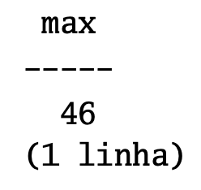

---

- Se for desejado saber a cidade (ou cidades) onde esta temperatura ocorreu pode-se tentar usar:

```sql
SELECT cidade FROM clima WHERE temp_min = max(temp_min); -- ERRADO
```

- mas não vai funcionar, porque a função de agregação max não pode ser usada na cláusula `WHERE` (Esta restrição existe porque a cláusula `WHERE` determina as linhas que vão passar para o estágio de agregação e, portanto, precisa ser avaliada antes das funções de agregação serem computadas).

---

- Entretanto, como é geralmente o caso, a consulta pode ser reformulada para obter o resultado pretendido, o que será feito por meio de uma subconsulta:

```sql
SELECT cidade FROM clima
 WHERE temp_min = (SELECT max(temp_min) FROM clima);
```

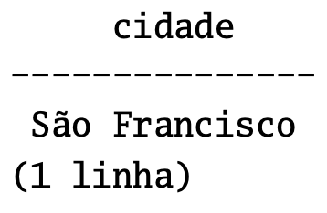

- Isto está correto porque a subconsulta é uma ação independente, que calcula sua agregação em separado do que está acontecendo na consulta externa. 

---

- As agregações também são muito úteis em combinação com a cláusula `GROUP BY`. Por exemplo, pode ser obtida a maior temperatura mínima observada em cada cidade usando:

```sql
SELECT cidade, max(temp_min)
 FROM clima
 GROUP BY cidade;
```

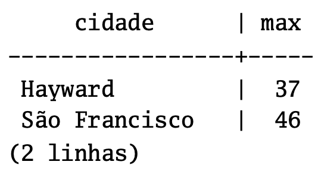

---

- Cada resultado da agregação é computado sobre as linhas da tabela correspondendo a uma cidade. As linhas agrupadas podem ser filtradas utilizando a cláusula `HAVING`

```sql
SELECT cidade, max(temp_min)
 FROM clima
 GROUP BY cidade
 HAVING max(temp_min) < 40;
```

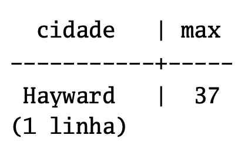

- que mostra os mesmos resultados, mas apenas para as cidades que possuem todos os valores de temp_min abaixo de 40. Para concluir, se desejarmos somente as cidades com nome começando pela letra “S” podemos escrever:

---

```sql
SELECT cidade, max(temp_min)
 FROM clima
 WHERE cidade LIKE 'S%'Œ
 GROUP BY cidade
 HAVING max(temp_min) < 40;
```

- O operador LIKE faz correspondência com padrão.

---

- É importante compreender a interação entre as agregações e as cláusulas `WHERE` e `HAVING` do SQL.

- A diferença fundamental entre `WHERE` e `HAVING` é esta: `WHERE` seleciona as linhas de entrada antes dos grupos e agregações serem computados (portanto, controla quais linhas irão para o computo da agregação), enquanto `HAVING` seleciona linhas de grupo após os grupos e agregações serem computados.

- Portanto, a cláusula `WHERE` não pode conter funções de agregação; não faz sentido tentar utilizar uma agregação para determinar quais linhas serão a entrada da agregação. Por outro lado, a cláusula `HAVING` sempre contém funções de agregação (A rigor, é permitido escrever uma cláusula `HAVING` que não possua agregação, mas é desperdício: A mesma condição poderia ser utilizada de forma mais eficiente no estágio do `WHERE`).

---

- No exemplo anterior, a restrição do nome da cidade pode ser aplicada na cláusula `WHERE`, porque não necessita de nenhuma agregação, sendo mais eficiente que colocar a restrição na cláusula `HAVING`, porque evita realizar os procedimentos de agrupamento e agregação em todas as linhas que não atendem a cláusula `WHERE`.

--- 

<!--
_backgroundColor: #FF7F50
_color: #FDF5E6
-->

# UPDATE

---

- As linhas existentes podem ser atualizadas utilizando o comando `UPDATE`. Suponha que foi descoberto que as leituras de temperatura estão todas mais altas 2 graus após 28 de novembro de 1994. Os dados podem ser atualizados da seguinte maneira:

```sql
UPDATE clima
 SET temp_max = temp_max - 2, temp_min = temp_min - 2
 WHERE data > '1994-11-28';
```

- Agora vejamos o novo estado dos dados: 

```sql
SELECT * FROM clima;
```

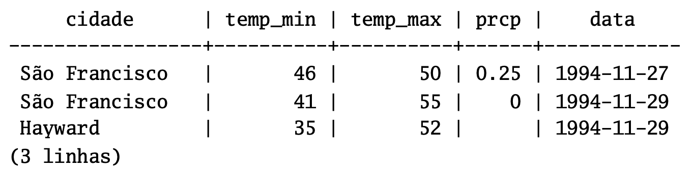

---

<!--
_backgroundColor: #FF7F50
_color: #FDF5E6
-->

# DELETE

---

- As linhas podem ser removidas da tabela através do comando `DELETE`. Suponha que não estamos mais interessados nos registros do clima em Hayward. Então precisamos excluir estas linhas da tabela. 

```sql
DELETE FROM clima WHERE cidade = 'Hayward';
```

- Todos os registros de clima pertencentes a Hayward são removidos.

```sql
SELECT * FROM clima;
```

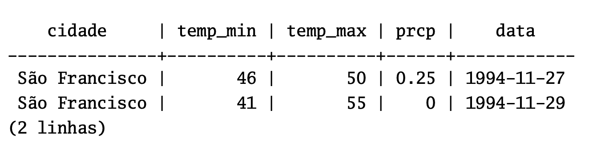

---

- Deve-se tomar cuidado com comandos na forma:

```sql
DELETE FROM nome_da_tabela;
```

- Sem uma qualificação, o comando `DELETE` remove todas as linhas da tabela, deixando-a vazia.

- O sistema **não** solicita confirmação antes de realizar esta operação! 

---

<!--
_backgroundColor: #FF7F50
_color: #FDF5E6
-->

# OBSERVAÇÕES

---

**1. Embora o SELECT * seja útil para consultas rápidas, geralmente é considerado um estilo ruim para código em produção, uma vez que a adição de uma coluna à tabela mudaria os resultados.**

**2. Em alguns sistemas de banco de dados, incluindo as versões antigas do PostgreSQL, a implementação do `DISTINCT` ordena automaticamente as linhas e, por isso, o `ORDER BY` é redundante. Mas isto não é requerido pelo padrão SQL, e o PostgreSQL corrente não garante que `DISTINCT` faça com que as linhas sejam ordenadas.**

---

<!--
_backgroundColor: #FF7F50
_color: #FDF5E6
-->

# OPERAÇÕES RELACIONAIS

---

# 1. UNION

- **UNION**: retorna todas os valores indicados para
as relações envolvidas na operação.

```sql
SELECT CIDADE FROM FORNECEDOR

UNION

SELECT CIDADE FROM PECA

UNION

SELECT CIDADE FROM PROJETO;
```

---

# 2. INTERSECT

- **INTERSECT**: retorna somente os valores que
são comuns as duas relações para os atributos
solicitados.

```sql
SELECT CIDADE FROM FORNECEDOR
INTERSECT
SELECT CIDADE FROM PECA; -- Peças
```

---

# 3. EXCEPT

- **EXCEPT**: retorna os valores presentes na primeira relação que não estão na segunda relação. A operação de diferença é a única em que a ordem das relações interfere no resultado.

```sql
SELECT CIDADE FROM FORNECEDOR
EXCEPT
SELECT CIDADE FROM PECA;
```

---

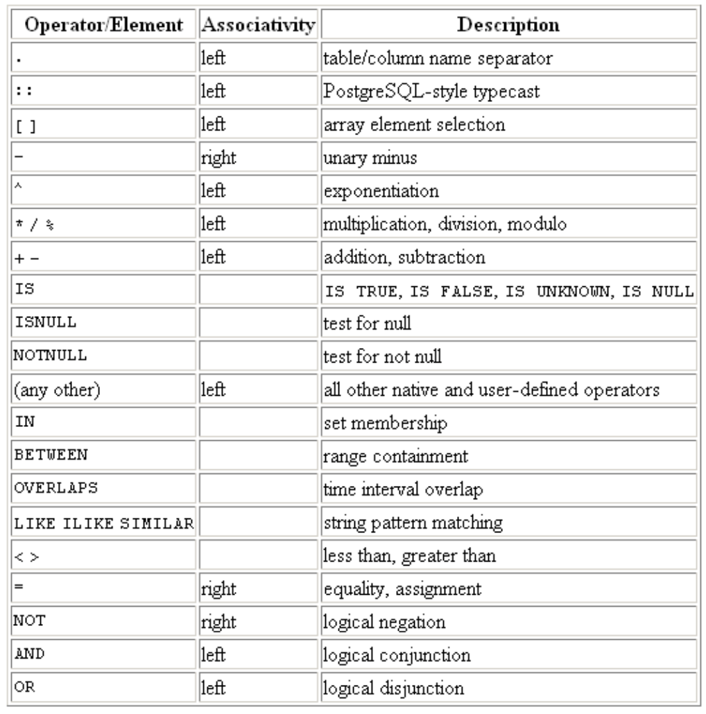

---

# Demais Operadores

```sql
select quantidade from fornecimento where quantidade < 300; -- less than

select quantidade from fornecimento where quantidade <> 300; -- <> or != Not equal

select quantidade from fornecimento where quantidade < 300; -- greater than

select quantidade from fornecimento where quantidade = 300;

select cidade from peca where cidade = any (select cidade from projeto);

select cidade from peca where cidade = some (select cidade from projeto);

select cidade from peca where cidade in (select cidade from projeto);

select cod_peca, quantidade, (quantidade*0.1) as porcentual from fornecimento where cod_peca = 'P1';

select quantidade from fornecimento where quantidade between 300 and 500;
```

---

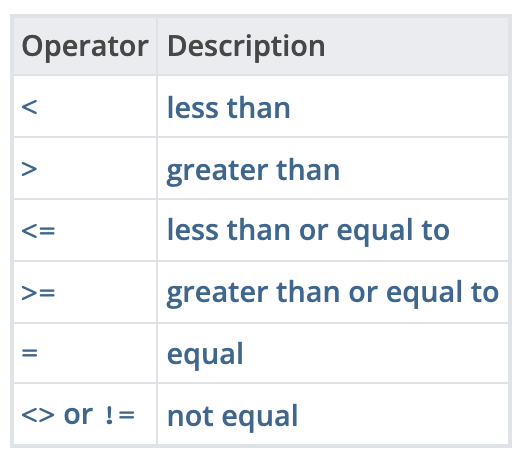

---

### Mais operações possíveis:

```sql
select * from peca where pnome like 'B%';

select * from peca where pnome ilike 'b%';

select * from projeto where cidade = 'ATENAS' or cidade = 'OSLO';

select * from projeto where cidade ilike 'atenas' or cidade ilike 'oslo';

select cod_peca from peca where peso notnull;

select cod_peca from peca where peso isnull;

select (numero::integer) * 2 from teste; 
-- O campo numero foi definido como char e transformado em inteiro para fazer a multiplicação
```

---

### Mais operações:

```sql
create table teste ( id numeric(20),numero char(10));

insert into teste values (1,'1000');

insert into teste values (2,'11/21/2006');

select * from teste;

select (numero::integer)/2 from teste where id = 1;

select (numero::date)+30 from teste where id = 2;

select (numero::timestamp) from teste where id = 2;
```

---

### Operações com funções de agregação:

```sql
select count(*) from fornecimento; -- -> conta linhas

select sum(peso) from peca; -- -> soma dos valores do campo

select avg(peso) from peca; -- -> média dos valores do campo

select min(peso) from peca; -- -> mínimo dos valores do campo
```

---

### Operações com funções matemáticas:

```sql
select trunc(78.9); -- -> inteiro

select sqrt(121); -- -> raiz quadrada

select power(2,4); -- -> exponencial

select abs(-23.76); -- -> absoluto

select trunc(peso) from peca;
```

---

### Operações de funções com strings

```sql
 select fnome||sobrenome from fornecedor; -- ->
concatenação

select bit_length(fnome) from fornecedor; -- -> número de bits

select char_length('fulano'); -- -> número de caracteres

select upper('fulano'); -- -> maiúsculas

select lower('FULANO'); -- -> minúsculas

select substring('Olivia Palito' from 8); -- -> string a partir da posição indicada
```

---

<!--
_backgroundColor: #FF7F50
_color: #FDF5E6
-->

# FUNCIONALIDADES AVANÇADAS

---

- Nos capítulos anteriores foi descrita a utilização básica da linguagem SQL para armazenar e acessar dados no **PostgreSQL**. Agora serão mostradas algumas funcionalidades mais avançadas da linguagem SQL que simplificam a gerência, e evitam a perda e a corrupção dos dados.

- Em certas ocasiões esta sessão faz referência aos exemplos encontrados nas sessões anteriores para modificá-los ou melhorá-los, portanto recomenda-se que as outras sessões tenham sido estudadas.

---

<!--
_backgroundColor: #FF7F50
_color: #FDF5E6
-->

# FUNCIONALIDADES AVANÇADAS

# 1. VIEWS

---

- Supondo que a consulta combinando os registros de clima e de localização das cidades seja de particular interesse para um aplicativo, mas que não se deseja digitar esta consulta toda vez que for necessária, então é possível criar uma visão baseada na consulta, atribuindo um nome a esta consulta pelo qual será possível referenciá-la como se fosse uma tabela comum. 

```sql
CREATE VIEW minha_visao AS
 SELECT cidade, temp_min, temp_max, prcp, data, localizacao
 FROM clima, cidades
 WHERE cidade = nome;
```

```sql
SELECT * FROM minha_visao;
```

---

- Fazer livre uso de visões é um aspecto chave de um bom projeto de banco de dados SQL. As visões permitem encapsular, atrás de interfaces que não mudam, os detalhes da estrutura das tabelas, que podem mudar na medida em que os aplicativos evoluem.

- As visões podem ser utilizadas em praticamente todos os lugares onde uma tabela real pode ser utilizada. Construir visões baseadas em visões não é raro. 

---

<!--
_backgroundColor: #FF7F50
_color: #FDF5E6
-->

# FUNCIONALIDADES AVANÇADAS

# 2. CHAVES ESTRANGEIRAS

---

- Considere o seguinte problema: Desejamos ter certeza que não serão inseridas linhas na tabela clima sem que haja um registro correspondente na tabela cidades. Isto é chamado de manter a integridade referencial dos dados.

- Em sistemas de banco de dados muito simples poderia ser implementado (caso fosse) olhando primeiro a tabela cidades para verificar se existe a linha correspondente e, depois, inserir ou rejeitar a nova linha de clima.

- Esta abordagem possui vários problemas, e é muito inconveniente, por isso o SQL pode realizar esta operação por você. 

---

- A nova declaração das tabelas ficaria assim:

```sql
CREATE TABLE cidades (
 cidade varchar(80) primary key,
 localizacao point
);
```

```sql
CREATE TABLE clima (
 cidade varchar(80) references cidades(cidade),
 temp_min int,
 temp_max int,
 prcp real,
 data date
);
```

---

- Agora, ao se tentar inserir uma linha inválida: 

```sql
INSERT INTO clima VALUES ('Berkeley', 45, 53, 0.0, '1994-11-28');

-- ERROR: insert or update on table "clima" violates foreign key constraint "clima_cidade_fkey"

-- DETAIL: Key (cidade)=(Berkeley) is not present in table "cidades".
```

```sql
-- Tradução da mensagem

ERRO: inserção ou atualização na tabela "clima" viola a restrição de chave estrangeira
"clima_cidade_fkey"
DETALHE: Chave (cidade)=(Berkeley) não está presente na tabela "cidades".
```

---

<!--
_backgroundColor: #FF7F50
_color: #FDF5E6
-->

# FUNCIONALIDADES AVANÇADAS

# 3. TRANSAÇÕES

---

- **Transação** é um conceito fundamental de todo sistema de banco de dados.

- O ponto essencial da transação é englobar vários passos em uma única operação de tudo ou nada.

- Os estados intermediários entre os passos não são vistos pelas demais transações simultâneas e, se ocorrer alguma falha que impeça a transação chegar até o fim, então nenhum dos passos intermediários irá afetar o banco de dados de forma alguma.

---

- Por exemplo, considere um banco de dados de uma instituição financeira contendo o saldo da conta corrente de vários clientes, assim como o saldo total dos depósitos de cada agência.

- Suponha que se deseje transferir $100.00 da conta da Alice para a conta do Bob. Simplificando barbaramente, os comandos SQL para esta operação seriam:

```sql
UPDATE conta_corrente SET saldo = saldo - 100.00
 WHERE nome = 'Alice';

UPDATE filiais SET saldo = saldo - 100.00
 WHERE nome = (SELECT nome_filial FROM conta_corrente WHERE nome = 'Alice');

UPDATE conta_corrente SET saldo = saldo + 100.00
 WHERE nome = 'Bob';

UPDATE filiais SET saldo = saldo + 100.00
 WHERE nome = (SELECT nome_filial FROM conta_corrente WHERE nome = 'Bob');
```

---

- Os detalhes destes comandos não são importantes aqui; o importante é o fato de existirem várias atualizações distintas envolvidas para realizar uma operação bem simples.

- A contabilidade quer ter certeza que todas as atualizações são realizadas, ou que nenhuma delas é realizada.

- Não é interessante uma falha no sistema fazer com que Bob receba $100.00 que não foi debitado da Alice. Também a Alice não continuará sendo uma cliente satisfeita se o dinheiro for debitado da conta dela e não for creditado na de Bob.

- É necessário garantir que, caso aconteça algo errado no meio da operação, nenhum dos passos executados até este ponto produza efeito.

- **Agrupar as atualizações em uma transação dá esta garantia.**

- Uma transação é dita como sendo **atômica**: do ponto de vista das outras transações, ou a transação acontece completamente ou nada acontece.

---

- Desejamos, também, ter a garantia de estando a transação completa e aceita pelo sistema de banco de dados, que esta fique **permanentemente gravada**, e não seja perdida mesmo no caso de acontecer uma pane logo em seguida.

- Por exemplo, se estiver sendo registrado saque em dinheiro pelo Bob não se deseja, de forma alguma, que o débito em sua conta corrente desapareça por causa de uma pane ocorrida logo depois dele sair da agência.

- Um **banco de dados transacional** garante que todas as atualizações realizadas por uma transação ficam registradas em meio de armazenamento permanente (ou seja, em disco), antes da transação ser considerada completa. 

---

- Outra propriedade importante dos bancos de dados transacionais está muito ligada à noção de atualizações atômicas:

- quando várias transações estão executando simultaneamente, cada uma delas não deve enxergar as alterações incompletas efetuadas pelas outras.

- Por exemplo, se uma transação está ocupada totalizando o saldo de todas as agências, não pode ser visto o débito efetuado na agência da Alice mas ainda não creditado na agência do Bob, nem o contrário. 

- Portanto, as transações devem ser tudo ou nada não apenas em termos do efeito permanente no banco de dados, mas também em termos de visibilidade durante o processamento.

- As atualizações feitas por uma transação em andamento não podem ser vistas pelas outras transações enquanto não terminar, quando todas as atualizações se tornam visíveis ao mesmo tempo.

---

- No PostgreSQL a transação é definida envolvendo os comandos SQL da transação pelos comandos `BEGIN` e `COMMIT`.

- Sendo assim, a nossa transação bancária ficaria: 

```sql
BEGIN;

UPDATE conta_corrente SET saldo = saldo - 100.00
 WHERE nome = 'Alice';

COMMIT;
```

---

- Se no meio da transação for decidido que esta não deve ser efetivada (talvez porque tenha sido visto que o saldo da Alice ficou negativo), pode ser executado o comando `ROLLBACK` em vez do `COMMIT` para fazer com que todas as atualizações sejam canceladas.

- O PostgreSQL, na verdade, trata todo comando SQL como sendo executado dentro de uma transação. Se não for utilizado o comando `BEGIN`, então cada comando possui um `BEGIN` e, se der tudo certo, um `COMMIT` individual envolvendo-o. Um grupo de comandos envolvidos por um `BEGIN` e um `COMMIT` é algumas vezes chamado de bloco de transação. 

**Nota**: Algumas bibliotecas cliente emitem um comando `BEGIN` e um comando `COMMIT` automaticamente, fazendo com que seja obtido o efeito de um bloco de transação sem ser perguntado. Verifique a documentação da interface utilizada.

---

- É possível controlar os comandos na transação de uma forma mais granular utilizando os pontos de salvamento
(savepoints). Os pontos de salvamento permitem cancelar partes da transação seletivamente, e efetivar as demais partes.

- Após definir o ponto de salvamento, através da instrução `SAVEPOINT`, é possível cancelar a transação até o ponto de salvamento, se for necessário, usando `ROLLBACK TO`. Todas as alterações no banco de dados efetuadas entre a definição do ponto de salvamento e o cancelamento são desprezadas, mas as alterações efetuadas antes do ponto de salvamento são mantidas.

- Após cancelar até o ponto de salvamento este ponto de salvamento continua definido e, portanto, é possível cancelar várias vezes. Ao contrário, havendo certeza que não vai ser mais necessário cancelar até o ponto de salvamento, o ponto de salvamento pode ser liberado, para que o sistema possa liberar alguns recursos. 

---

- Deve-se ter em mente que liberar ou cancelar até um ponto de salvamento libera, automaticamente, todos os ponto de salvamento definidos após o mesmo.

- Tudo isto acontece dentro do bloco de transação e, portanto, nada disso é visto pelas outras sessões do banco de dados.

- Quando o bloco de transação é efetivado, as ações efetivadas se tornam visíveis como uma unidade para as outras sessões, enquanto as ações canceladas nunca se tornam visíveis.

- Recordando o banco de dados da instituição financeira, suponha que devesse ser debitado $100.00 da conta da Alice e creditado na conta do Bob, mas que foi descoberto em seguida que era para ser creditado na conta do Wally. Isso poderia ser feito utilizando pontos de salvamento:

---

```sql
BEGIN;
UPDATE conta_corrente SET saldo = saldo - 100.00
 WHERE nome = 'Alice';

SAVEPOINT meu_ponto_de_salvamento;

UPDATE conta_corrente SET saldo = saldo + 100.00
 WHERE nome = 'Bob';

-- uai ... o certo é na conta do Wally

ROLLBACK TO meu_ponto_de_salvamento;

UPDATE conta_corrente SET saldo = saldo + 100.00
 WHERE nome = 'Wally';
COMMIT;
```

---

- Obviamente este exemplo está simplificado ao extremo, mas é possível efetuar um grau elevado de controle sobre a transação através do uso de pontos de salvamento.

- Além disso, a instrução `ROLLBACK TO` é a única forma de obter novamente o controle sobre um bloco de transação colocado no estado interrompido devido a um erro, fora cancelar completamente e começar tudo de novo. 

---

<!--
_backgroundColor: #FF7F50
_color: #FDF5E6
-->

# FUNCIONALIDADES AVANÇADAS

# 4. HERANÇA

---

- Herança é um conceito de banco de dados orientado a objeto, que abre novas possibilidades interessantes ao projeto de banco de dados.

- Vamos criar duas tabelas: a tabela cidades e a tabela capitais. Como é natural, as capitais também são cidades e, portanto, deve existir alguma maneira para mostrar implicitamente as capitais quando todas as cidades são mostradas. Se formos bastante perspicazes, poderemos criar um esquema como este: 

### COMPARE:

---

```sql
CREATE
 TABLE capitais (
 nome text,
 populacao real,
 altitude int, -- (em pés)
 estado char(2)
);

CREATE TABLE interior (
 nome text,
 populacao real,
 altitude int -- (em pés)
);

CREATE VIEW cidades AS
 SELECT nome, populacao, altitude FROM capitais
 UNION
 SELECT nome, populacao, altitude FROM interior;
```

- Este esquema funciona bem para as consultas, mas não é bom quando é necessário atualizar várias linhas, entre outras coisas. Esta é uma solução melhor:

---

```sql
CREATE TABLE cidades (
 nome text,
 populacao real,
 altitude int -- (em pés)
);

CREATE TABLE capitais (
 estado char(2)
) INHERITS (cidades);
```

---

- Neste caso, as linhas da tabela capitais herdam todas as colunas (nome, populacao e altitude) da sua tabela
ancestral cidades.

- No PostgreSQL uma tabela pode herdar de nenhuma, uma, ou de várias tabelas. 

- Por exemplo, a consulta abaixo retorna os nomes de todas as cidades, incluindo as capitais dos estados, localizadas a uma altitude superior a 500 pés: 

```sql
SELECT nome, altitude
 FROM cidades
 WHERE altitude > 500;
```

---

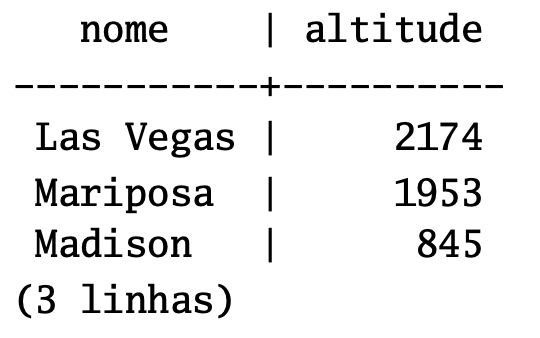

---

- Por outro lado, a consulta abaixo traz todas as cidades que não são capitais de estado e estão situadas a uma altitude superior a 500 pés:

```sql
SELECT nome, altitude
 FROM ONLY cidades
 WHERE altitude > 500;
```

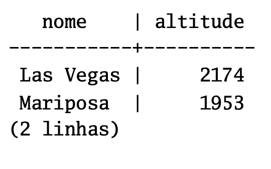

---

- Nesta consulta a palavra chave `ONLY` antes de cidades indica que a consulta deve ser efetuada apenas na tabela cidades, sem incluir as tabelas abaixo de cidades na hierarquia de herança.

- Muitos comandos mostrados até agora — `SELECT`, `UPDATE` e `DELETE` — permitem usar a notação `ONLY`. 

**Nota**: Embora a hierarquia seja útil com freqüência, como não está integrada às restrições de unicidade e de chave estrangeira, sua utilidade é limitada.

---

<!--
_backgroundColor: #FF7F50
_color: #FDF5E6
-->

# FUNCIONALIDADES AVANÇADAS

# 5. TRIGGERS

---

- **Triggers: Gatilhos** – são disparados a partir de um evento no banco de dados, como exclusão, inserção ou atualização. Podem acontecer antes ou depois destes eventos.

- Executa procedimentos.

---

```sql
CREATE OR REPLACE FUNCTION backupfor() RETURNS trigger AS $$

BEGIN

insert into bakfornec (SELECT * FROM FORNECEDOR);

RETURN NULL;

END;

$$

LANGUAGE plpgsql;

CREATE TRIGGER tbackup

AFTER DELETE ON fornecedor

FOR EACH ROW EXECUTE PROCEDURE backupfor();
```

- A trigger indicada é responsável por executar a função que faz uma cópia das linhas da tabela fornecedor para uma tabela auxiliar, toda vez que uma exclusão é executada.

---

# Fim

<!-- _footer: 'The end for now' -->
